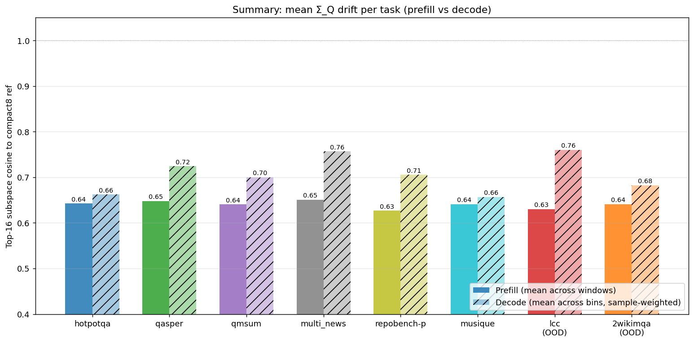
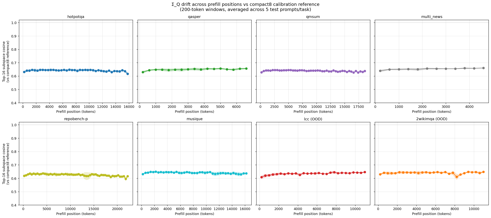
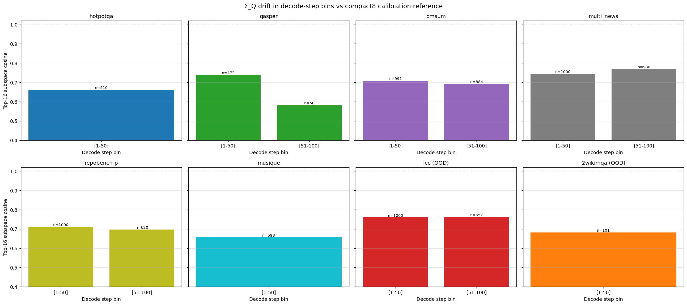
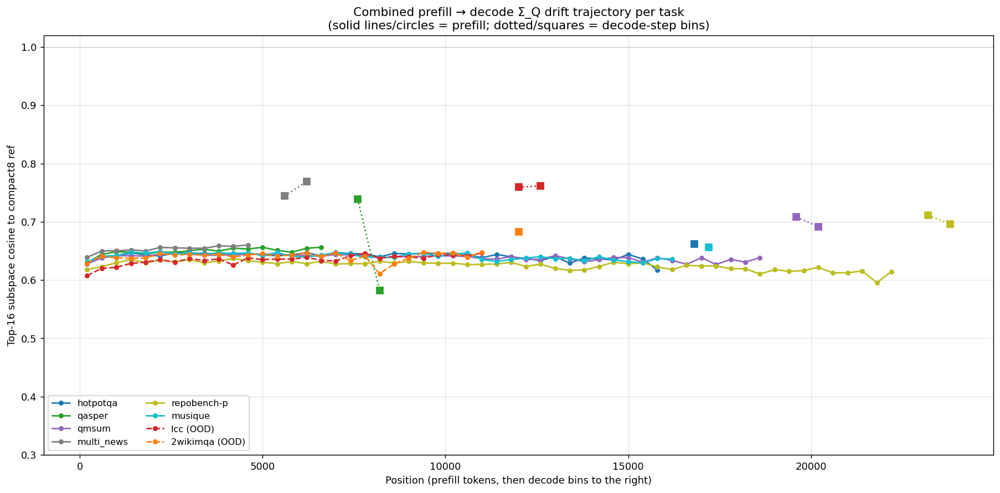

# Q-distribution shift analysis on Llama-3.1-8B at K=2 V=3

**Date:** 2026-05-14
**Goal:** test whether the JointQK F1 disconnect on Llama is explained by
Σ_Q distribution drift — either (a) across tasks (lcc OOD vs calibration) or
(b) within the decode trajectory.

## Setup

- 8 tasks: 6 in compact8 calibration (hotpotqa, qasper, qmsum, multi_news,
  repobench-p, musique) + 2 OOD (lcc, 2wikimqa).
- Reference: pooled compact8 Σ_Q from
  `artifacts/bases/jointqk_llama31_8b_longbench_compact8_n400.pt`
  (the basis JQ actually uses in production).
- Metric: **top-16 subspace cosine** between window Σ_Q and reference Σ_Q,
  averaged across (L≥1, h). Computed via batched GPU `torch.linalg.eigh`.
- Prefill: 5 test prompts per task; 200-token sliding windows.
- Decode: 20 test prompts per task, captured via `model.generate` + RoPE hook;
  binned by step `[1, 50]`, `[51, 100]`. Max 100 decode steps.

Artifacts:
- Raw metrics: `artifacts/q_distribution_shift/per_task_drift.json`
- Charts: `notes/figs/q_drift/{prefill_drift,decode_drift,combined_trajectory,summary_bars}.png`

## Headline result — the disconnect is NOT in the top-16 Σ_Q subspace

| task | in compact8? | prefill cos | decode cos | F1 (JQ K=2 baseline) | F1 inversion |
|---|---|---:|---:|---:|---:|
| hotpotqa | yes | 0.64 | 0.66 | 59.27 | −2.9 vs TQ |
| qasper | yes | 0.65 | 0.72 | 44.04 | +0.1 |
| qmsum | yes | 0.64 | 0.70 | 25.93 | +1.3 |
| multi_news | yes | 0.65 | 0.76 | — | — |
| repobench-p | yes | 0.63 | 0.71 | 40.87 | −2.1 |
| musique | yes | 0.64 | 0.66 | — | — |
| **lcc** | **no** | **0.63** | **0.76** | **35.58** | **−12.5** |
| **2wikimqa** | **no** | 0.64 | 0.68 | 50.90 | **+4.0** |

**Prefill cosines cluster tightly at 0.63–0.65 across all 8 tasks** — no separation
between in-calibration and OOD tasks. lcc's cosine (0.63) is statistically
indistinguishable from in-calibration repobench-p (0.63) or musique (0.64).

This is a **strong negative result**: the prefill top-16 Σ_Q subspace alignment
does NOT explain the F1 disconnect. lcc and 2wikimqa (both OOD, both with
opposite-direction F1 outcomes) score the same on this metric.

## Within-prefill drift is essentially zero

Per-task cosine is **flat across prefill positions** (200-token windows from 0
to ~16K tokens). No early-context vs late-context drift. The basis fits the
prefill K distribution equally well at the start, middle, and end of the prompt
on every task.

This refutes a "mid-context drift" mechanism.

## Decode-Q is MORE aligned with calibration than prefill-Q

Counter to my pre-experiment hypothesis ("decode-Q drifts from prefill-Q over
generation"), decode-bin cosines are **uniformly higher than prefill cosines**
across all 8 tasks. The decode-step `[1-50]` and `[51-100]` bins are also nearly
identical to each other — no within-decode drift.

This refutes the "decode trajectory drift" mechanism for the F1 inversion.

## Combined trajectory view

Solid lines (prefill) are tight around 0.63–0.65 with no slope. Decode-bin
squares jump UP to 0.66–0.77 (not down). The trajectory tells the same story
from every angle: **Σ_Q top-16 subspace alignment to the calibration reference
is task-agnostic on this metric and is not predictive of F1 outcomes.**

## Interpreting "all tasks cluster at 0.64"

Two non-exclusive explanations:

1. **The metric has a noise floor.** A 200-token window with 4 q-heads gives
   ~800 samples per (L, h) — for `d=128`, the empirical Σ_Q has rank 128 but
   the small eigenvalues are sample-noise. Top-16 eigenvectors of the empirical
   Σ_Q estimate are partially noise-driven; comparing them to the well-estimated
   pooled reference (computed from 4.4M tokens) produces a similarity-to-noise
   floor around 0.6–0.7 regardless of true distributional alignment.

2. **The reference is a "consensus" across diverse tasks.** Pooled compact8 Σ_Q
   averages 400 prompts spanning 8 tasks; no single task's Σ_Q matches it
   exactly. The pooled top-16 captures a "median" direction set that's modestly
   aligned (~0.6) with each task's top-16 but not perfectly aligned with any.

Decode bins beating prefill (~0.7 vs 0.64) is consistent with explanation 1 —
the decode bins aggregate across 20 prompts × ~50 tokens × 4 heads = ~4000+
samples, giving a less noisy Σ_Q estimate that better matches the reference's
top-16.

## What this rules out

Combining with prior experiments documented in `bench_results_report.md`,
`jointqk_disconnect_investigation.md`, `q_distribution_shift.md` (this file),
and the local Llama-verify run:

| hypothesis | status |
|---|---|
| K reconstruction error (K-MSE, top-1, top-5) | ✗ — JQ wins by huge margins |
| Attention probability KL distortion | ✗ — JQ wins by 4-7× |
| Attention output L2 error | ✗ — JQ wins by 10× |
| First-decode logit KL | ✗ — JQ wins on lcc by 2.4× |
| K error bias structure | ✗ — JQ has lower bias than TQ |
| Zero-bit coords cause systematic drift | partial — bit-floor=1 closed only 3.85 pp of 12.5 pp gap; hurt other tasks badly |
| Calibration domain shift (lcc OOD) | mostly ✗ — adding lcc to calibration closed only 0.4–2.3 pp |
| **Top-16 Σ_Q subspace mismatch** | ✗ — all tasks score 0.63–0.65 in prefill |
| Within-prefill Σ_Q drift | ✗ — flat across positions |
| Within-decode Σ_Q drift | ✗ — decode bins more aligned than prefill, not less |

## What this leaves

The F1 inversion remains unexplained by any single-axis basis-mismatch measure
we can compute on calibration captures. The fact that JQ's first-decode logit
KL is *lower* than TQ's (proven on lcc, hotpotqa, qasper, repobench-p in the
earlier `logit_kl_llama_k2.json` experiment) while autoregressive F1 sharply
prefers TQ implies the mechanism is in **multi-step autoregressive
compounding** — small per-step JQ errors must correlate across positions in a
way TQ's random-Hadamard errors do not.

The Σ_Q-shift hypothesis explored here would have predicted lcc's prefill cosine
to be visibly lower than in-calib tasks; it isn't. So the multi-step error
correlation must come from a structural property of R_sym's reconstruction that
*looks identical* under per-window distributional metrics but creates
*correlated noise* across decode steps. Candidates worth probing next:

1. **Cross-position correlation of K reconstruction error.** For each (L, h, q-head),
   compute the autocorrelation of `q · (K_full − K_recon)^T` across token
   positions. If JQ's error has positive autocorrelation across positions (same
   direction biases consistently) and TQ's doesn't, that's the mechanism.

2. **Effective rank of the reconstruction-error covariance** — JQ's basis
   concentrates error into a few directions (the zero-bit and low-bit coords);
   TQ spreads it uniformly. Per-step error vectors that share a direction will
   accumulate constructively under softmax+V.

3. **W_O projection of the attention output error** — we measured raw attn-out
   L2 (JQ wins), but the model only sees `W_O @ attn_out`. If W_O has structure
   that suppresses TQ's noise but passes JQ's signal-error coupling, that would
   explain the inversion at the residual-stream level.

The basis-mismatch dead end pivots the investigation toward **error correlation
structure**, not error magnitude or basis alignment.

## Pointers to artifacts

- F1 calibration-coverage sweep (Part 1):
  - `artifacts/bench_llama_compact9/` (8 cells with compact9 basis)
  - `artifacts/bench_llama_lcconly/` (8 cells with lcc-only basis)
- Σ_Q analysis (this doc):
  - `artifacts/q_distribution_shift/per_task_drift.json`
  - `notes/figs/q_drift/*.png`
- Source code:
  - `pipelines/scripts/analyze_q_distribution_shift.py`
  - `pipelines/scripts/capture_decode_q_llama_multi_task.py`
  - `pipelines/scripts/plot_q_distribution_shift.py`
  - `pipelines/scripts/build_calibration_artifacts_from_pool.py` (now
    supports `--filter-config <task>` for single-task bases)
