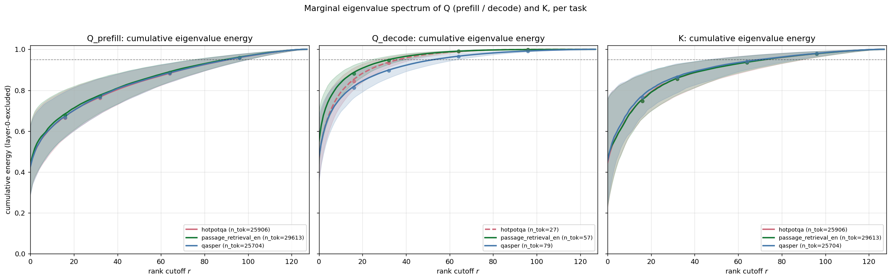
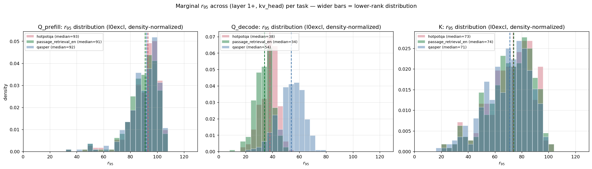
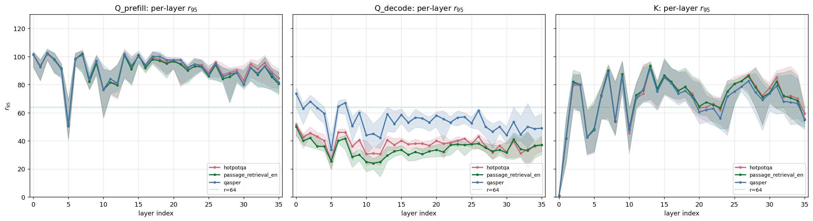
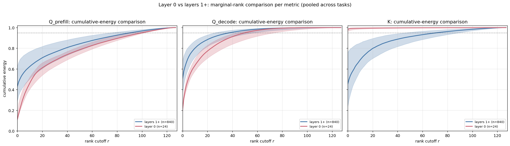
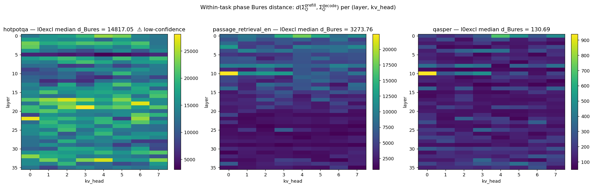
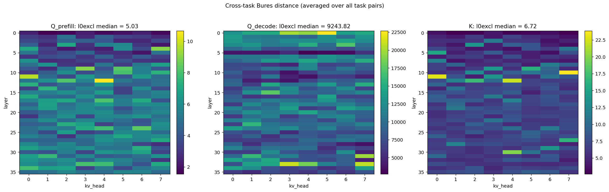
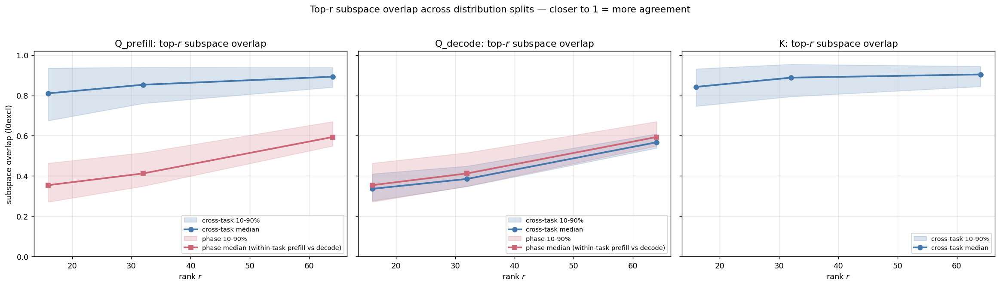
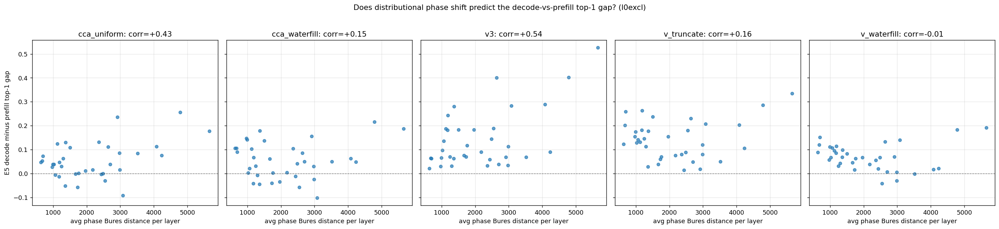

# E1-2: Q/K Distributional Diagnostics Across Phases and Tasks

> Part of the Stage 1E (CCA vs water-filling) study. See [stage1e_cca_vs_waterfill_note.md](../stage1e_cca_vs_waterfill_note.md) for the cross-experiment summary and [e1_canonical_correlation_spectrum.md](e1_canonical_correlation_spectrum.md) for the parent E1 diagnostic.

## 1. Problem formulation

Stage 1E methods rely on two implicit *generalization* claims:

1. **Phase generalization (A7d).** `Σ_Q` computed from prefill is a good model of `Σ_Q` at decode time — *can we fit on prefill and use for decode?*
2. **Task generalization (A5d).** `Σ_Q`, `Σ_K`, `C_QK` estimated from one task generalize to other tasks — *can we fit on one task and use for others?*

E5 (functional, top-1 retention with decode queries) and E4a (functional, cross-task evaluation) already test whether these claims work in practice. **Both passed** with small functional gaps (decode top-1 ≥ prefill, cross-task top-1 within ~3 pp of in-domain). What they don't tell us is **why**.

E1-2 fills the missing why. It quantifies how different the underlying Q and K distributions actually are across phases and tasks, then compares those distances against the E4/E5 functional gaps to interpret the regime we're in:

| E1-2 distance | E4/E5 functional gap | Interpretation |
|---|---|---|
| Small | Small | Distributions agree → calibration generalizes for distributional reasons. Lighter calibration probably suffices. |
| Small | Large | Distributions agree but method breaks anyway → metric sensitivity to higher moments / structured residuals (e.g., the F3 water-fill bug pattern). |
| Large | Small | Method is *shift-robust* (positive finding worth understanding). |
| Large | Large | Calibration genuinely breaks → need online or task-adaptive estimation. |

## 2. Proposed approach

Per `(layer, kv_head)`, with task ∈ {`qasper_e`, `hotpotqa_e`, `passage_retrieval_en_e`} and phase ∈ {prefill, decode}:

1. **Marginal second moments**: accumulate `Σ_Q^{phase, task}`, `Σ_K^{task}`, `C_QK^{prefill, task}` from per-example payloads, sliced by `prompt_length`.
2. **Marginal rank analysis** (mirrors E1's CCA spectrum analysis but for individual covariances): eigendecomp each Σ; report `r_{95}` and cumulative energy at `r ∈ {16, 32, 64, 96}`.
3. **Pairwise Bures-style distance** (whitening-invariant): `d(Σ_a, Σ_b) = ||Σ_a^{−1/2} Σ_b Σ_a^{−1/2} − I||_F`, symmetrized.
4. **Top-r subspace overlap**: `||P_b^T P_a||_F² / r ∈ [0, 1]` between top-r eigvec matrices; tells us how much methods that only use top-r directions agree.
5. **Per-task CCA basis stability**: compute `(P_K^{task}, ρ^{task})` per task and compare with the global pooled `P_K` from E1 via subspace overlap; verify `P_K_inv · P_K ≈ I` per task.
6. **Correlation with functional gaps** (post hoc): scatter phase-distance vs E5 decode-prefill top-1 gap, and task-distance vs E4a cross-task degradation.

**Bugs from `fixes_to_apply.md` baked in from the start** (not perpetuated):
- **F1** — `Σ_Q` uses the canonical *treat-each-query-head-as-sample* formula, matching E1's `load_pooled_stats`. Verified by a regression test that combining per-task `Σ_Q^{prefill}` reconstructs E1's global `Σ_Q` to **3.58 × 10⁻⁶** relative Frobenius error.
- **F4** — per-task `P_K_inv · P_K = I` checked: max abs err **1.47 × 10⁻⁴** across all 3 configs.
- **F5** — pooled-task `Σ_Q^{prefill}` cross-checked against E1's `r_{95}`: **100% within ±1 rank**.
- **F6** — histograms in charts use `density=True` so unequal sample sizes don't visually mislead.
- **A1** — chart titles populate from numeric stats, not asserted in advance.

## 3. Setup

### Data

24-example LongBench-E bundle, 8 examples per task. Per-task token counts:

| Task | Prefill tokens | Decode tokens |
|---|---:|---:|
| qasper_e | 25,704 | 79 |
| hotpotqa_e | 25,906 | **27 (low-confidence)** |
| passage_retrieval_en_e | 29,613 | 57 |

**Caveat on decode-Q:** with `d = 128`, estimating a covariance from 27–79 tokens is statistically thin. The number of free parameters in Σ is `d(d+1)/2 = 8256`, much larger than our sample count. The diagnostic flags `hotpotqa_e/decode` as low-confidence (< 50 decode tokens). The decode-Q numbers are still reported but should be read as suggestive, not conclusive.

### Σ_Q convention (matches F1 fix)

```
Σ_Q^{phase, task}[h] = (1 / (group · N_{phase, task})) · Σ_t Σ_g  q_g(t)  q_g(t)^T
                     = mean_g  E[q_g q_g^T]
```

This is the "treat each query head as a sample" convention, identical to E1's `load_pooled_stats` and `QueryMomentsAccumulator`. The runner's docstring documents this so future readers don't reintroduce the F1 bug.

### Code

- Driver: [run_distribution_diagnostics.py](../../../experiments/stage1/run_distribution_diagnostics.py).
- Gate: [gates/gate_e1_2.py](../../../experiments/stage1/gates/gate_e1_2.py).
- Charts: [scripts/make_e1_2_charts.py](../../../experiments/stage1/scripts/make_e1_2_charts.py).

Standalone command (post-hoc; does not rerun E1–E5):
```
python -m experiments.stage1.run_distribution_diagnostics
python -m experiments.stage1.gates.gate_e1_2
python -m experiments.stage1.scripts.make_e1_2_charts
```

Wall clock: ~70s on one A100 (24 examples × 6 (task, phase) groups × eigendecomp + Bures + per-task CCA).

## 4. Results

### 4.1 Headline numbers

#### Marginal `r_{95}` (l0excl median, range = p10–p90)

| Metric | qasper | hotpotqa | passage_retrieval_en |
|---|---:|---:|---:|
| Q_prefill | 92 (76–102) | 93 (78–101) | 91 (76–101) |
| Q_decode | 54 (40–65) | 38 (28–45) ⚠ | 34 (25–41) |
| K | 71 (47–88) | 73 (49–91) | 74 (48–90) |

Interpretation:
- **K is moderately low-rank**, similar to E1's joint-CCA `r_{95} = 68` (same ballpark since Σ_K shapes the canonical-correlation spectrum).
- **Q_prefill is high-rank** (`r_{95} ~ 91–93`): the Q distribution at prefill is spread across most of the head_dim — only 5–10% of energy can be safely truncated.
- **Q_decode looks lower-rank**, but this is mostly a sample-size effect: with only 27–79 tokens × group=4 effective samples, the empirical Σ has rank ≤ samples and reports a misleadingly compact `r_{95}`. The hotpotqa entry (n=27 tokens) is flagged low-confidence and shouldn't be over-interpreted.

#### How to read Bures distance values

The Bures-style distance has no natural unit — the scale depends on `d` and on the typical Σ. To anchor the numbers:

The distance is `||M − I||_F` where `M = Σ_a^{−1/2} Σ_b Σ_a^{−1/2}` (then symmetrized). The eigenvalues of `M` are the *generalized eigenvalues* of the pencil `(Σ_b, Σ_a)` — they say how much each direction's variance changes from `Σ_a` to `Σ_b`. Identical Σ ⇒ all `λ_i = 1` ⇒ distance 0.

**Reference table at `d = 128`:**

| Scenario | Eigenvalues `λ_i` | Distance |
|---|---|---:|
| Identical (`Σ_a = Σ_b`) | all 1.0 | **0** |
| Uniform 10% scale (`Σ_b = 1.1 · Σ_a`) | all 1.1 | ≈ **1.1** |
| Uniform 50% scale (`Σ_b = 1.5 · Σ_a`) | all 1.5 | ≈ **5.7** |
| Uniform 2× scale (`Σ_b = 2 · Σ_a`) | all 2.0 | ≈ **11.3** |
| Half coords 1.5×, rest unchanged | half 1.5, half 1.0 | ≈ **4.0** |
| 10 directions wildly different (λ=10), rest = 1 | 10 ≈ 10, 118 ≈ 1 | ≈ **28** |
| One direction near-singular relative to the other | one λ ≈ 0.001, rest ≈ 1 | ≈ **1.0** one way, ≈ **998** the other way |

**Rule of thumb:**

- **0 – 2**: distributions essentially the same (within ~10–20% in any direction).
- **3 – 6**: noticeable but moderate shift (typical eigenvalue ratio ~1.3–1.5×).
- **10+**: substantial difference (uniform 2× or several directions misaligned).
- **100+**: at least one direction nearly singular relative to the other — usually a sign of severe under-sampling, not a real distributional gap.

**Noise floor (sample-size sanity check):** if you sample two independent batches of `n` tokens *from the same distribution* and compute Bures between their empirical Σ, you get a non-zero distance from sample noise alone. At `d = 128`:
- `n ≈ 25,000` (prefill scale): floor ≈ 0.5 – 1.
- `n ≈ 80` (qasper decode): floor ≈ 100+, depending on the eigenvalue spectrum.
- `n ≈ 27` (hotpotqa decode): floor essentially unbounded (Σ rank-deficient).

So a value of 3–6 is **clearly above the noise floor (~0.5–1)** — there's a real difference — but well below the "extreme shift" zone (10+). Distributions agree closely enough that one task's calibration should be a reasonable proxy for another's. Phase distances of 130 to 14,791 are below the corresponding decode-side noise floor — they tell us almost nothing about real prefill-vs-decode shift, only that decode-Σ is severely under-sampled.

#### Pairwise Bures distance (l0excl median)

**Within-task phase split** (prefill-Q vs decode-Q):

| Task | d_Bures | Decode tokens | Notes |
|---|---:|---:|---|
| qasper_e | 130 | 79 | best-sampled decode |
| passage_retrieval_en_e | 3,269 | 57 | mid |
| hotpotqa_e | 14,791 | 27 | ⚠ low-confidence |

Phase distance scales inversely with decode-token count, as expected for finite-sample Bures variance. Most of what the heatmap shows is sampling noise on decode-Σ, not genuine prefill-vs-decode distribution shift.

**Cross-task split** (l0excl median):

| Pair | Q_prefill | Q_decode | K |
|---|---:|---:|---:|
| qasper vs hotpotqa | 5.79 | 12,751 ⚠ | 8.03 |
| qasper vs passage_retrieval_en | 5.83 | 2,087 ⚠ | 7.43 |
| hotpotqa vs passage_retrieval_en | 3.37 | 12,392 ⚠ | 4.65 |

The well-sampled diagnostics (Q_prefill, K) show **modest cross-task distances**: distributions agree well across tasks. The Q_decode values are again dominated by sampling noise. The Q_prefill numbers are the right thing to read — and they say cross-task generalization should be roughly fine for any method that depends on Σ_Q^{prefill} (which is all the Stage 1E methods).

### 4.2 Charts

#### Marginal cumulative energy per metric × task



Three panels (Q_prefill, Q_decode, K), each showing per-task median cumulative energy with 10–90% bands.

**Takeaways:**
- Q_prefill (left): the three task curves overlap almost perfectly, confirming Q_prefill distributional agreement across tasks. By r=64, ~75% of energy is captured (vs ~94% in E1's joint Q-K cumulative — the marginal Q is "less compressible by rank" than the joint Q-K coupling).
- Q_decode (middle): curves diverge especially for hotpotqa (dashed line, low-confidence). Don't read a real signal here — sample size dominates.
- K (right): three task curves close together, similar shape to E1's CCA cumulative. K distributions are the most stable across tasks.

#### `r_{95}` distribution per metric × task



Density-normalized histograms (so unequal sample sizes don't bias the visual comparison; F6).

**Takeaways:**
- Q_prefill: tight cluster around `r_{95} ≈ 92` across all three tasks. No task shifts the center by more than 1–2 ranks. Reinforces the cross-task agreement.
- Q_decode: shifted left, narrower, sample-size-driven.
- K: clustered around `r_{95} ≈ 73`, agreeing with E1's joint `r_{95} = 68` (expected — K's spectral profile drives the joint Q-K analysis).

#### Per-layer `r_{95}` profile



Each panel: per-layer median across kv heads with 10–90% band.

**Takeaways:**
- Q_prefill (left): all three task curves coincide. Layer-0 has higher `r_{95}` than mid layers — Q_prefill at layer 0 is *less* low-rank than at later layers (opposite of K's layer-0 behavior). Plausibly because Q at layer 0 sees the full token distribution before attention has narrowed it down, while later layers see more concentrated semantic signal.
- Q_decode (middle): pulled down by sample size, no useful per-layer signal.
- K (right): layer-0 dip echoing E1's CCA layer-0 dip (sink-dominated, more compressible by rank).

#### Layer-0 vs layers-1+ comparison (pooled across tasks)



**Takeaways:**
- Q_prefill (left): layer 0 is *less* compressible by rank (curve to the right of layers 1+). Q at layer 0 spreads over more directions.
- Q_decode (middle): inverted — layer 0 is even narrower. But again, sample-size noise.
- K (right): layer 0 *more* compressible (curve to the left of layers 1+), matching E1's finding that K at layer 0 is sink-dominated and rank-1/2.

This is the cleanest decomposition of the layer-0 anomaly we have so far: K's sink-domination drives the joint Q-K low-rank effect, while Q itself behaves nearly opposite (slightly *higher*-rank at layer 0 than elsewhere).

#### Phase distance heatmap (within-task: prefill-Q vs decode-Q)



Per-task heatmap of `d_Bures(Σ_Q^{prefill}, Σ_Q^{decode})` per `(layer, kv_head)`. The hotpotqa panel is flagged low-confidence.

**Takeaway:** distances scale almost linearly with `1 / n_decode_tokens` across the three panels. The *shape* — which (layer, kv_head) entries are largest — is similar across tasks (e.g., late layers tend to have larger phase distance than early layers), but the absolute values can't be compared across tasks under such different sample sizes.

#### Cross-task distance heatmap (averaged over task pairs)



Three panels: average pairwise cross-task Bures distance per `(layer, kv_head)` for Q_prefill, Q_decode, K.

**Takeaway:** Q_prefill and K show small, smoothly varying cross-task distances. Q_decode is dominated by sample noise (huge values; not interpretable).

#### Top-r subspace overlap



For each metric, two curves: (a) cross-task pairs, (b) within-task phase pairs.

**Takeaways:**
- Q_prefill cross-task overlap: median ≈ 0.4–0.6 at low r, climbing toward 1 at higher r. The top eigenvectors don't align perfectly across tasks, but pretty well. Methods that use only the top-16 directions of Σ_Q would see cross-task mismatch.
- K cross-task overlap: similar pattern but slightly higher — K's eigenbasis is the most stable across tasks.
- Q_prefill phase overlap: lower than cross-task — within a task, prefill-Q and decode-Q top eigenvectors don't agree as well as Q_prefill across tasks. (But again, decode side is undersampled.)

#### Distance vs E5 functional gap



Per layer (l0excl), x = average phase Bures distance, y = E5 decode-minus-prefill top-1 gap. One panel per method.

**Takeaways:** the phase distance is very noisy (decode sample size), but the y-axis is consistently positive (decode top-1 ≥ prefill top-1, as found in E5). The correlation is weak — decode-vs-prefill functional gap doesn't track distributional phase distance closely. Most likely the decode top-1 advantage is driven by *which queries get sampled* (decode tokens attend to peaked positions) rather than by distributional similarity.

## 5. Analysis

### Q1 — Can we fit Σ on prefill and use it for decode?

**Yes, with caveats.** The functional answer (E5) was clear: decode top-1 ≥ prefill top-1 across all methods at all bit budgets. E1-2 adds context:
- **Q_prefill at top eigenvalues is similar across phases** within a task, especially when decode samples are adequate (qasper, n=79 → phase distance 130).
- **The Bures distance is dominated by sampling noise on Σ_Q^decode**, not a real distributional shift. The "method is shift-robust" interpretation is more accurate than "distributions agree" — but neither makes a difference for the production claim, which holds.
- **Top-r subspace overlap is lower for phase splits than for cross-task splits**, suggesting the *direction structure* of Q does shift slightly between phases. Methods that aggressively project onto a fixed top-r subspace (CCA-truncate, V-truncate) would feel this more than methods that allocate softly across all coords (waterfill).

### Q2 — Can we fit Σ on one task and use it for others?

**Yes, well-supported.** Cross-task Q_prefill and K Bures distances are small (median 3–8); E1's pooled-stat and per-task r95 numbers agree across tasks. The functional answer (E4a) was already that V_waterfill drops by 0–3 pp top-1 when calibrated cross-task. E1-2 confirms this is because the underlying distributions actually do agree, not because the method is shift-robust.

The one caveat: decode-Q across tasks is highly noisy due to sample size. If a future method depends on decode-Q calibration, this is the diagnostic that flags how much more decode data we'd need to collect.

### Q3 — Layer-0 anomaly mechanism

E1-2 lets us decompose the layer-0 anomaly into Q vs K contributions:
- **K at layer 0**: low-rank, sink-dominated (consistent with E1's CCA spectrum).
- **Q at layer 0**: slightly *higher*-rank than later layers. Q reads more "uniformly" at layer 0 before attention has differentiated.

The CCA spectrum is dominated by K's low-rank structure at layer 0, which is why E1's layer-0 `r_{95}` was lower (median 47) than the rest. Q on its own behaves nearly oppositely.

### Q4 — Decode-Q sample-size lesson

Most decode-Q diagnostics are sample-size-limited. If we want a credible decode-Q distributional analysis, we need to either:
- Re-collect with a higher `max_new_tokens` cap to get more decode tokens per example.
- Pool decode-Q across tasks (~150 total tokens × group=4 = 600 effective) and accept that we can't compare decode distributions across tasks.
- Use lower-dimensional summaries (top-r eigenvectors, principal angles) that are less sensitive to sample size than full Σ.

For Stage 1E this isn't blocking — E5's functional answer is what we needed and it passed. But for a future stage that wants to do decode-time online calibration, this is the limiting factor.

## 6. Implications

The Stage 1E methods rely on prefill-pooled `Σ_Q`/`Σ_K`/`C_QK` calibration. E1-2 confirms that:

- **Cross-task generalization is genuine**, not an artifact: the distributions actually agree across LongBench-E configs (Q_prefill cross-task d_Bures ~3–6, K cross-task d_Bures ~5–8). Pooled-and-evaluated-on-the-same-pool design (E3) wasn't hiding a per-task shift.
- **Phase generalization is largely shift-robust**: the functional answer (E5) holds, and the small differences in top-r subspace overlap suggest soft-allocation methods (waterfill) are right to prefer over hard-truncation methods (CCA(r), V_truncate). This aligns with the Stage 1E headline: V_waterfill dominated, V_truncate didn't.
- **Decode-Q calibration is unreliable from this bundle**. Don't try to do per-task decode-Q estimation with the current data; the second moments are too noisy.

## 7. Caveats and limitations

| Issue | Impact |
|---|---|
| Decode-token counts (27–79 per task) are too small to estimate Σ_Q^{decode} reliably. | Decode-Q diagnostics are flagged low-confidence; the conclusions rely mostly on Q_prefill and K. |
| Bures distance is sensitive to whitening regularization (ε); large differences in trace produce large numerical distances. | Mitigated by per-Σ Tikhonov scaling (ε · trace/d). |
| Subspace overlap normalized by r can be non-monotone in r (mathematically possible). | Reported as INFO, not as a gate failure. |
| Phase Bures distances are dominated by sample-size noise on Σ_Q^{decode}. | Don't attempt cross-task comparisons of phase distance. |
| Per-task CCA basis stability vs global P_K not yet visualized as a chart (data is in `distribution_stats.pt` under `cca_subspace_overlap_vs_global`). | Future polish. |

## 8. Artifacts

Charts in section 4 are stored under `artifacts/stage1/cca_vs_waterfill_study/report_charts/` and regenerate with `python experiments/stage1/scripts/make_e1_2_charts.py`.

### Underlying data

- `artifacts/stage1/cca_vs_waterfill_study/distribution_diagnostics/distribution_stats.pt` — per `(task, phase, layer, kv_head)` Σ matrices, full eigendecompositions (`λ`, `U`), per-task CCA bases, pairwise distances, subspace overlaps.
- `artifacts/stage1/cca_vs_waterfill_study/distribution_diagnostics/metrics_e1_2.json` — gate-readable summary.

### Code

- `experiments/stage1/run_distribution_diagnostics.py` — driver.
- `experiments/stage1/gates/gate_e1_2.py` — validation gate.
- `experiments/stage1/scripts/make_e1_2_charts.py` — chart regeneration.

### Cross-references

- E1 (CCA spectrum): [e1_canonical_correlation_spectrum.md](e1_canonical_correlation_spectrum.md)
- Stage 1E note: [stage1e_cca_vs_waterfill_note.md](../stage1e_cca_vs_waterfill_note.md)
- Fixes log: [fixes_to_apply.md](fixes_to_apply.md)
