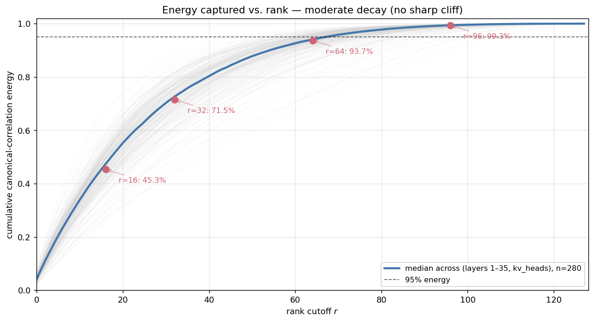
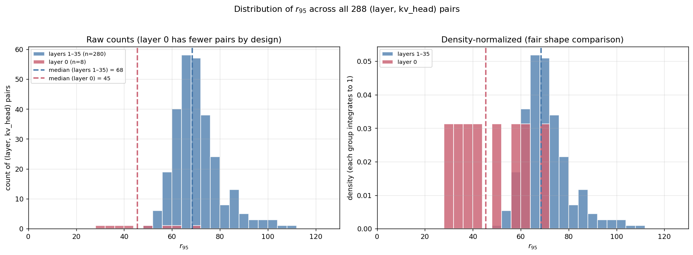
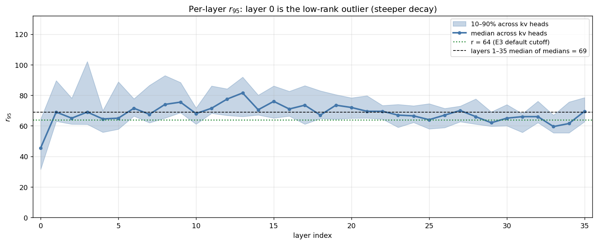
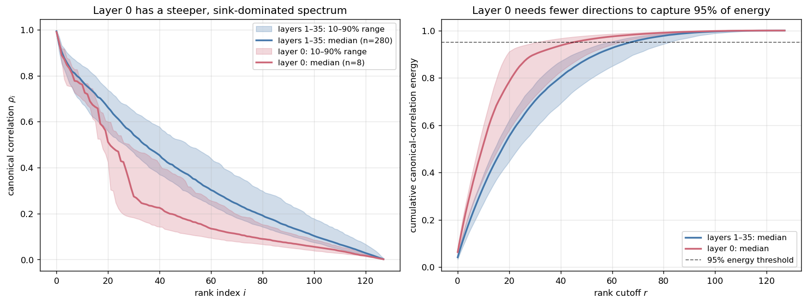
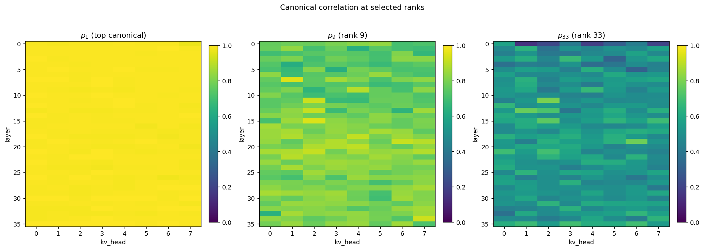

# E1: Canonical Correlation Spectrum Diagnostic

> Part of the Stage 1E (CCA vs water-filling) study. See [stage1e_cca_vs_waterfill_note.md](../stage1e_cca_vs_waterfill_note.md) for the cross-experiment summary.

## 1. Problem formulation

We have a calibration corpus of prefill activations: per-example post-RoPE queries `q_t ∈ ℝ^d` and keys `k_t ∈ ℝ^d` for each `(layer, kv_head)`, with `t = 1, ..., L_prompt` ranging over the prefill positions of every example. The Stage 1E proposal pipes these through CCA: rotate keys into a basis where the first few coordinates carry most of the attention-relevant information, then quantize aggressively on the dropped coordinates.

That proposal only makes sense if such a low-rank, attention-relevant subspace **exists**. E1 is the diagnostic that answers two specific questions, *before* any compression code is written:

- **Q1 — Coupling rank.** Is there a small `r ≪ d` such that most of the joint Q-K structure lives in `r` directions, leaving `d − r` directions where Q "doesn't read" K (and thus those K coordinates can be cheaply discarded or low-bit quantized)?
- **Q2 — Universality.** Does that low-rank structure hold uniformly across `(layer, kv_head)` pairs, or does the right `r` vary so much that no single hyperparameter works?

The mathematical object that answers both questions is a **CCA-style second-moment spectrum**: a list of singular values `ρ_1 ≥ ρ_2 ≥ ... ≥ ρ_d ∈ [0, 1]` measuring how strongly the i-th whitened direction of K couples to the i-th whitened direction of Q. A spectrum that drops fast → low-rank coupling, lots of compression headroom. A flat spectrum → no compression handle at all; CCA is useless and we should fall back to V3.

E1 is purely diagnostic. It does not pick a method or tune a hyperparameter; it tells us whether E2/E3 are worth running and roughly where to set the rank cutoff `r`.

## 2. Proposed approach

Classical CCA is usually written for centered covariance matrices. Stage 1E intentionally uses the **uncentered second moments** `Σ_Q = E[qq^T]`, `Σ_K = E[kk^T]`, and `C_QK = E[qk^T]`, because the downstream attention objective is the raw logit `q^T k`, not a centered covariance score. With those raw moments, we solve the same whitening/SVD problem on the **whitened cross-moment matrix**:

```
M = Σ_Q^{−1/2} · C_QK · Σ_K^{−1/2}    →    M = U · diag(ρ) · V_h
```

The singular values `ρ_1, ..., ρ_d` are CCA-style coupling values and lie in `[0, 1]` after the regularized whitening used here. The columns of `U`/`V_h` give the canonical directions in whitened space; un-whitening gives the canonical directions in the original Q and K spaces.

Concretely:

1. **Whitening factors** (Tikhonov-regularized eigh-based): `W_Q = Σ_Q^{−1/2}`, `W_K = Σ_K^{−1/2}`.
2. **Whitened cross-moment**: `M = W_Q · C_QK · W_K^T`.
3. **SVD**: `M = U · diag(ρ) · V_h`.
4. **Projection matrices** (saved for E2/E3 to reuse):
   - `P_K = V_h · W_K` projects a key onto canonical-K coordinates.
   - `P_K_inv = W_K^{-1} · V_h^T` is its inverse.
   - `P_Q = U^T · W_Q` projects a query onto canonical-Q coordinates.

Per-`(layer, kv_head)`: 36 layers × 8 kv-heads = 288 separate CCA solves.

## 3. Setup and code

### Data

- **Bundle**: `artifacts/stage1/query_stats_longbench_under4k/` — 24 LongBench-E examples (8 each from `qasper`, `hotpotqa`, `passage_retrieval_en`).
- **Tokens used**: 81,223 prefill tokens total (sum of `prompt_length` across all examples). Decode-phase positions are *excluded* — only Q at the model's reading positions enters the moments.
- Per example, post-RoPE `q_post` (shape `(36, 32, captured_length, 128)`) and `k_post` (shape `(36, 8, captured_length, 128)`) are sliced to `[:, :, :prompt_length, :]`.
- GQA is 4-to-1 (32 query heads → 8 kv heads, group size 4).

### Σ_Q

Loaded from `pooled_stats.pt` ([run_cca_diagnostics.py:83-100](../../../experiments/stage1/run_cca_diagnostics.py#L83-L100)), which was built by `QueryMomentsAccumulator` over per-query-head outer products. Then averaged across each kv-head's group of 4 query heads:

```
Σ_Q[h] = (1/group) · Σ_g E[q_g q_g^T]    ("treat heads as samples")
```

### Σ_K

Loaded directly from `pooled_stats.pt`'s `k_post` second-moment block. Shape `(36, 8, 128, 128)`. No GQA pooling needed since K already has one entry per kv head.

### C_QK

Streamed online from per-example `.pt` payloads via [accumulate_cqk](../../../experiments/stage1/run_cca_diagnostics.py#L103-L136), driving [CrossMomentsAccumulator](../../../experiments/stage1/toolkit/moments.py#L86-L120). Per example: GQA-pool Q within each group (`q_grouped = mean_g q_g`), then accumulate `Σ_t q_grouped(t) · k(t)^T`. Cached at `cqk_cache.pt` so the pipeline can resume cheaply.

For the C_QK case, "average then outer" and "outer then average" agree because C_QK is linear in q. So whether we GQA-pool before or after the outer product is irrelevant for C_QK.

### Whitening

[whitening_factor](../../../experiments/stage1/toolkit/metric_transform.py#L30-L63) does:

```python
cov_sym = (cov + cov.T) / 2
scale   = trace(cov_sym) / d                 # average eigenvalue
reg     = eps * scale * I                    # ε = 1e-4 by default
eigvals, eigvecs = eigh(cov_sym + reg)
eigvals = eigvals.clamp_min(eps * scale)     # guard tiny/negative numerics
W       = diag(1/√eigvals) @ eigvecs.T
W_inv   = eigvecs @ diag(√eigvals)
```

The `ε · trace/d` regularization is dimensionally correct (small *relative to* the average eigenvalue, not in absolute terms). The eigenvalue clamp guards against subtractive cancellation pushing tiny eigenvalues negative.

### CCA SVD + projections

[compute_cca_basis](../../../experiments/stage1/toolkit/metric_transform.py#L66-L128). After whitening Q and K and forming `M`, we run a standard `torch.linalg.svd` and clamp `ρ` to `[0, 1.001]`. The projection matrices follow directly. The reconstruction identity `P_K_inv · P_K = W_K^{-1} · V_h^T · V_h · W_K = I` holds because `V_h^T V_h = I` (orthogonal) and `W_K^{-1} W_K = I`.

### Plots

[run_cca_diagnostics.py:295-341](../../../experiments/stage1/run_cca_diagnostics.py#L295-L341):
- `figures/spectrum_overlay.png` — 288 curves of `ρ_i` vs `i`, plus median in bold.
- `figures/r95_heatmap.png` — `min{r : Σ_{i≤r} ρ_i² / Σ ρ_i² ≥ 0.95}` per `(layer, kv_head)`.
- `figures/spectrum_per_layer.png` — per-layer median spectrum, color-coded by layer index.

### Validation gate

[gates/gate_e1_e2.py](../../../experiments/stage1/gates/gate_e1_e2.py) asserts:

1. `ρ ∈ [0, 1.01]` at every `(layer, head, j)`.
2. `ρ_{j+1} ≤ ρ_j` (monotone non-increasing) within each `(layer, head)`.
3. Layer-0 ρ is *not* uniformly ≈ 1.0 (would indicate regularization swamped signal).
4. SciPy generalized-eigenvalue cross-checks on three seeded `(layer, kv_head)` samples match our top-3 ρ to relative error ≤ 5e-2.
5. `P_K_inv · P_K ≈ I` across all 288 heads.
6. `r95_max < head_dim` (some compression headroom must exist somewhere).

## 4. Results

Run on 2026-04-29 over the full 24-example bundle. End-to-end wall clock: ~5 min cold, ~30 sec cached.

### Headline numbers

| Statistic | Value |
|---|---:|
| `(layer, kv_head)` pairs | 288 |
| Total prefill tokens | 81,223 |
| `ρ` range across all 288×128 entries | `[0.0000, 0.9985]` |
| `ρ` monotone within each `(layer, head)` | ✓ |
| Layer-0 ρ minimum | 0.0002 (not collapsed) |
| 95%-energy rank `r_{95}` — min | 28 |
| 95%-energy rank `r_{95}` — median | 68 |
| 95%-energy rank `r_{95}` — max | 109 |
| SciPy cross-check rel. error (top-3 ρ at layer=1, head=0) | 1.19 × 10⁻⁴ |

### Chart 1 — Cumulative canonical-correlation energy vs. rank



This is the most operationally relevant view of the spectrum. Each light-gray line is one `(layer, kv_head)` pair from layers 1–35 (excluding layer 0). The blue line is the median; red dots annotate the median energy captured at the four candidate rank cutoffs. The dashed black line at 95% marks the threshold for the `r_{95}` statistic.

**Key takeaway:** `r = 64` (the E3 default) captures **~94% of canonical-correlation energy** in the median head, ranging from ~87% (10th percentile) to ~96% (90th percentile) outside layer 0. There is **no sharp cliff** — the decay is moderate and gradual. The 5–13% of energy that lives in coordinates 64–127 isn't negligible, especially under metrics (top-1) that react to structured residuals.

| Rank cutoff `r` | Median energy captured | 10–90% across `(layer, head)` |
|---:|---:|---:|
| 16 | 45.3% | 36.9% – 51.4% |
| 32 | 71.5% | 59.7% – 78.7% |
| 64 | **93.7%** | 86.6% – 96.1% |
| 96 | 99.3% | 98.1% – 99.6% |

### Chart 2 — Distribution of `r_{95}` across all (layer, kv_head) pairs



A histogram of `r_{95}` — the smallest rank capturing 95% of canonical-correlation energy — across all 288 `(layer, kv_head)` pairs. Layer 0's 8 pairs are highlighted in red; layers 1–35's 280 pairs are in blue. Dashed lines mark the medians.

**Key takeaway:** Layers 1–35 form a tight unimodal distribution centered at `r_{95} = 68`. Layer 0 sits at a *lower* `r_{95}` (median 45) — its spectrum is *steeper*, not flatter, contrary to what one might guess from "layer 0 is anomalous". The tightness of the layers-1–35 distribution justifies a fixed `r` hyperparameter outside layer 0.

### Chart 3 — Per-layer `r_{95}` profile



For each layer, the blue line shows the median `r_{95}` across the 8 kv heads, with the band giving the 10–90% range. Reference lines: green dotted = `r = 64` (E3 cutoff), black dashed = median-of-medians for layers 1–35.

**Key takeaway:** Layer 0 is the visible dip at the left. Layers 1–35 hover around the median `r_{95} ≈ 68`, with no clear depth-related trend (early/mid/late layers behave similarly). The `r = 64` reference line sits just below the layers-1–35 median, confirming it as a borderline-aggressive choice that captures most of the energy in the typical head but loses a bit in the upper-percentile heads.

### Chart 4 — Layer 0 vs layers 1–35: spectrum and cumulative energy



Two panels comparing the layer-0 distribution (red) to the layers-1–35 distribution (blue). Solid lines are medians; bands are 10–90% percentiles. Left: the canonical-correlation spectrum directly. Right: cumulative-energy curves with the 95% threshold marked.

**Key takeaway:** Layer 0's first 1–2 CCA-style coupling values carry essentially all of the joint Q-K energy — by index 30 the layer-0 cumulative-energy curve is already at ~95%, while layers 1–35 are at ~70%. This is the signature of attention-sink behavior: rank-1 or rank-2 structure dominated by 1–2 BOS-style tokens. Layer 0 is **easier** to compress by rank, but harder to interpret because top-1 attention reduces to "did I keep the sink?" rather than "did I keep the right key?".

### Chart 5 — Canonical correlation at selected ranks (heatmap)



Three side-by-side heatmaps of `ρ_i` per `(layer, kv_head)` at ranks 1, 9, and 33. Color scale 0 (dark) → 1 (yellow).

**Key takeaway:** `ρ_1 ≈ 1.0` everywhere (median 0.9933, all 288 pairs > 0.95) — there's always a privileged top canonical direction. By `ρ_9` the picture is mixed (0.4–0.9 across heads), and by `ρ_{33}` most heads are below 0.4. So the "low-rank handle" exists but is shallow: the first ~10–30 directions carry meaningful joint structure, the rest are essentially noise from CCA's perspective.

### Headline numbers (text summary)

The charts' values flow into this gate-readable summary:

| Statistic | Value |
|---|---:|
| `(layer, kv_head)` pairs | 288 |
| Total prefill tokens | 81,223 |
| `ρ` range across all 288×128 entries | `[0.0000, 0.9985]` |
| `ρ` monotone within each `(layer, head)` | ✓ |
| Layer-0 ρ minimum | 0.0002 (not collapsed) |
| `r_{95}` overall — min / median / max | 28 / 68 / 109 |
| `r_{95}` overall max location | (layer=8, kv_head=5) |
| `r_{95}` layer 0 — min / median / max | 28 / 45 / 70 |
| `r_{95}` layers 1–35 — min / median / max | 48 / 68 / 109 |
| SciPy cross-check rel. error (top-3 ρ at layer=1, head=0) | 1.19 × 10⁻⁴ |

## 5. Analysis

### Q1 — Is there a low-rank attention-relevant subspace? Yes, but moderate.

Outside layer 0, the median `r_{95}` is 68 out of 128 head-dim — i.e., **95% of the canonical-correlation energy is concentrated in the top ~53% of canonical directions**. That's a real compression handle, but a moderate one. It's not the dramatic 80%-in-top-10% that would justify aggressive rank truncation. At `r = 64` (the cutoff E3 actually uses), the median head retains ~94% of canonical energy, with the worst-case 10th-percentile head retaining ~87%. The remaining 5–13% lives in the `d − r` discarded coordinates and, as Stage 1D's layer-0 paradox warned, even small structured residuals can hurt attention-rank preservation. So E1's "yes" is a permission to *try* CCA, not a guarantee it will beat alternatives.

### Q2 — Is the structure uniform? Mostly yes, with layer 0 as a steeper-spectrum outlier.

Excluding layer 0, `r_{95}` for the remaining 35 layers × 8 heads = 280 pairs has a tight distribution around the median 68 (10th–90th percentile range: 60–84). That tightness justifies hyperparameter universality: a single fixed `r` (e.g. 64) is a defensible operating point for almost every `(layer, head)` outside layer 0.

Layer 0 is the standing exception, but in the **opposite direction** from what one might guess: its `r_{95}` median is 47 (range 28–70), *lower* than the rest. Layer 0's canonical-correlation spectrum is *steeper*, not flatter — the first 1–2 ranks carry most of the joint Q-K energy. This is the well-known attention-sink behavior at layer 0: a small number of BOS-style sink tokens dominate, so the joint Q-K distribution is effectively low-rank with respect to those few sinks. The convention is still to report layer-0-excluded headlines, but the reason is "layer 0 is a different attention regime", not "layer 0 is harder to compress by rank". It is, in fact, *easier* to compress by rank — but the metric we ultimately care about (top-1 attention rank retention) behaves anomalously there because the top-1 attention is concentrated on the same few sinks regardless of compression.

### Are ρ near 1.0 anywhere? Yes, at the top.

`ρ_max = 0.9985` says that for some `(layer, head, i=0)`, the top canonical correlation is essentially 1.0 — Q's first canonical direction is almost a deterministic function of K's first canonical direction. That's the strongest possible signal for the existence of a privileged attention direction. But this doesn't generalize to *all* directions: by index 50–70, ρ has dropped well below 0.5 in most heads.

### Layer-0 regularization sanity

The gate flags failure if `min(ρ[layer 0]) > 0.99`, which would indicate that the regularization swamped the signal (so all whitened directions look maximally correlated). The actual layer-0 minimum is 0.0002, four orders of magnitude below the threshold — so `ε = 1e-4 · trace/d` is doing its job without distorting the spectrum.

### What E1 is *not* claiming

- E1 does **not** say CCA-based compression will work in practice. It says the structural prerequisite (low-rank Q-K coupling) exists, which is necessary but not sufficient. E2 (closed-form rate-distortion) and E3 (real quantization) are what test sufficiency.
- E1 does **not** validate that the specific Σ_Q convention used here (treat heads as samples) gives the right basis for downstream methods. That's an E3/E4 concern.
- E1 does **not** prove that decode-phase queries will exploit the same canonical directions. E5 tests that.

## 6. Caveats and known issues

| Issue | Severity | Status |
|---|---|---|
| The 280-curve plot label in the original auto-generated diagnostic is a small typo — actual count is 288 (36 layers × 8 kv heads). The report chart excludes layer 0 intentionally and therefore shows 280 curves. | cosmetic | leave as-is |
| F1: E4's calibration originally used a different Σ_Q convention from E1/E3. | medium (affects E4 comparability with E3 calibration) | applied in code; E4 post-F1 rerun still pending in this review state |
| F4: gate did not check `P_K_inv · P_K ≈ I`. | medium | applied; current max abs error is `1.31e-4` |
| F5: gate cross-check was single `(layer, head)`. | low | applied; now checks three seeded heads |
| F13: terminology in some Stage 1E docs/code says classical centered CCA, while the implementation uses uncentered second moments. | docs | open for broader cleanup; this note now uses "second-moment CCA" wording |
| Tikhonov ε = 1e-4 is heuristic | low | layer-0 sanity check gives confidence it's OK |

The Σ_Q-convention discrepancy was the most consequential E1-adjacent issue. E1 itself uses the intended "samples-pooled" convention; the downstream E4 calibration code has been corrected, but E4 artifacts must be regenerated before drawing final cross-task / LOO conclusions.

The centered-vs-uncentered wording issue does not change E1's rank conclusion: a quick centered-covariance recomputation during re-review moved layer-0-excluded `r95` from `48/68/109` to `49/69/109` (min/median/max). It does change the absolute interpretation of the top singular values (`rho1` median outside layer 0 drops from `0.993` to `0.940` under centering), so reports should be precise that the shipped artifact is an uncentered second-moment diagnostic.

## 7. Implications for downstream experiments

- E2's closed-form simulation can use the `(P_K, P_K_inv, ρ)` from E1 directly. After F8, CCA Q-weighted distortion uses the trace-formula weight `diag((P_K_inv)^T Σ_Q P_K_inv)`, while `ρ` still controls the spectrum diagnostic and CCA-uniform rank ordering.
- E3 (real per-coord quantization) reuses the projections `P_K, P_K_inv`. The reconstruction identity is implicit but worth asserting in the gate.
- The fact that median `r_{95}` is 68 (just over half of d) tells us a fixed-rank truncation at r = 64 is plausible — but only if we accept ~5% canonical-correlation energy loss. For methods that *zero out* low-ρ coordinates entirely (like CCA + uniform), even that 5% may be too much. This is exactly what E3 will quantify.

## 8. Artifacts

Charts in section 4 are stored under `artifacts/stage1/cca_vs_waterfill_study/report_charts/` and regenerate with `python experiments/stage1/scripts/make_e1_charts.py`.

### Underlying data

- `artifacts/stage1/cca_vs_waterfill_study/cca_stats.pt` — `ρ` (288×128), `P_K`, `P_K_inv`, `P_Q`, plus M_q eigendecomp.
- `artifacts/stage1/cca_vs_waterfill_study/cqk_cache.pt` — accumulated `C_QK` (288×128×128).
- `artifacts/stage1/cca_vs_waterfill_study/metrics_e1_e2.json` — gate-readable summary (`rho_min`, `rho_max`, `r95_*`, etc.).

### Original diagnostic figures (auto-generated by run_cca_diagnostics.py)

- `artifacts/stage1/cca_vs_waterfill_study/figures/spectrum_overlay.png`
- `artifacts/stage1/cca_vs_waterfill_study/figures/r95_heatmap.png`
- `artifacts/stage1/cca_vs_waterfill_study/figures/spectrum_per_layer.png`

### Code

- `experiments/stage1/run_cca_diagnostics.py` — driver.
- `experiments/stage1/toolkit/metric_transform.py` — `whitening_factor`, `compute_cca_basis`.
- `experiments/stage1/toolkit/moments.py` — `CrossMomentsAccumulator`.
- `experiments/stage1/gates/gate_e1_e2.py` — validation gate.
- `experiments/stage1/scripts/make_e1_charts.py` — chart regeneration.
