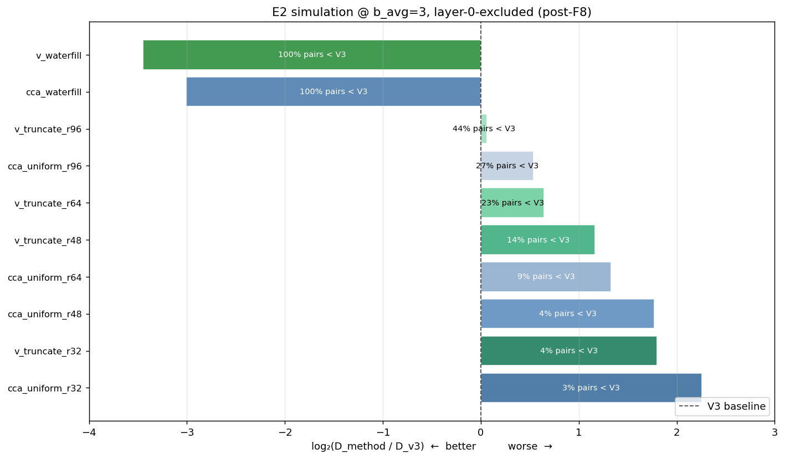
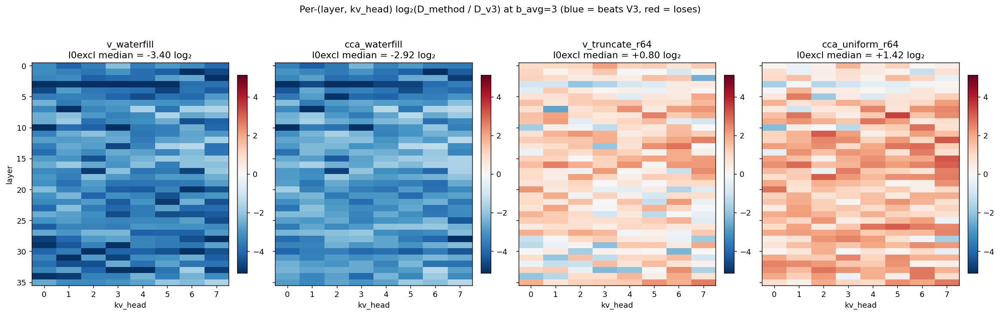
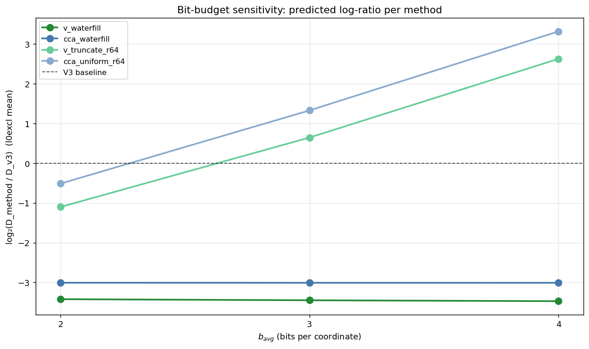
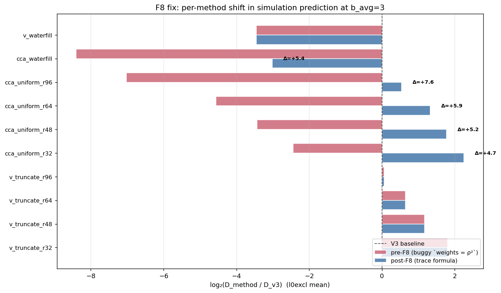
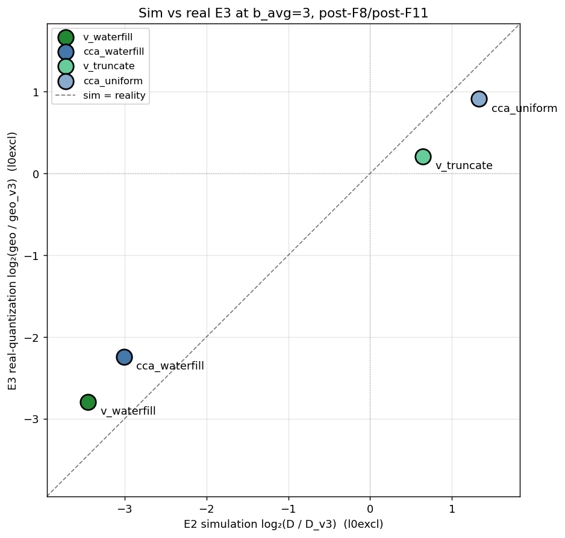

# E2: Closed-Form Rate-Distortion Simulation

> Part of the Stage 1E (CCA vs water-filling) study. Builds on E1's CCA basis. See [e1_canonical_correlation_spectrum.md](e1_canonical_correlation_spectrum.md) and the cross-experiment [stage1e_cca_vs_waterfill_note.md](../stage1e_cca_vs_waterfill_note.md).

## 1. Problem formulation

E1 confirmed that the CCA basis exists and that the joint Q-K spectrum has compression headroom (median `r_{95}` = 68 / 128 outside layer 0). E2 is the next step in the cheap-before-expensive ladder: **predict, in closed form, what each (basis × allocation) method would achieve** in terms of Q-weighted distortion, before paying the cost of E3's real quantization.

The methods being predicted:

| Method | Basis | Allocation |
|---|---|---|
| **`v3`** | random Hadamard (V3 baseline) | uniform `b_avg` bits/coord (after unit-normalize) |
| **`v_truncate`** | V (eigvecs of `M_q = E[qq^T]`) | top-r at uniform `b_avg · d / r` bits, rest 0 |
| **`v_waterfill`** | V | continuous water-fill on `λ_j · σ²_j(V)` |
| **`cca_uniform`** | CCA `P_K = V_h · Σ_K^{-1/2}` | top-r at uniform bits, rest 0 |
| **`cca_waterfill`** | CCA `P_K` | continuous water-fill on `diag((P_K^{-1})^T Σ_Q P_K^{-1})_j · σ²_j(CCA)` *(post-F8 trace-formula objective)* |

Three concrete questions E2 should answer:

- **Q1.** Which method has the lowest predicted Q-weighted distortion at fixed `b_avg`?
- **Q2.** Does the predicted ranking depend on `b_avg` and `r`?
- **Q3.** How does the closed-form prediction compare to E3's real per-coord quantization? (This is the simulation-vs-reality assumption A3 from the Stage 1E plan.)

E2 is the **right place to detect upstream issues cheaply** — if simulation and reality disagree at b_avg=3, we can zoom in on (basis, allocation) and trace the disagreement before sinking GPU hours.

## 2. Proposed approach

### 2.1 Bennett's high-rate distortion

For a scalar Lloyd-Max quantizer with `b` bits applied to a coord with input variance `σ²`, the high-rate distortion approximation is:

```
D_j ≈ σ²_j · 2^{−2 b_j}
```

(the `(c · σ²)` constant from Panter–Dite cancels in ratios). For a per-coord allocation `b_1, ..., b_d` with `Σ b_j = b_avg · d`, total distortion in the quantized basis is:

```
D_basis = sum_j σ²_j · 2^{−2 b_j}
```

### 2.2 Mapping basis-distortion to Q-weighted distortion

The metric we ultimately care about is `E[(q^T (k − k̂))²]`, which equals `trace(M_q · E[Δk Δk^T])` where `M_q = Σ_Q`. After Bennett-style quantization in some rotated basis, this trace gives a per-coord weight that depends on the basis's relationship to `M_q`.

For the **V basis** (orthogonal, eigvecs of `M_q`):

```
D_Q-weighted = sum_j λ_j · σ²_j(V) · 2^{−2 b_j}
```

where `λ_j` is the j-th eigenvalue of `M_q` and `σ²_j(V) = (V^T Σ_K V)_{jj}`. This is exact (modulo Bennett's high-rate approximation).

For the **CCA basis** (non-orthogonal, `P_K = V_h · Σ_K^{-1/2}`), the right per-coord weight comes from the trace formula and equals `((P_K^{−1})^T Σ_Q P_K^{−1})_{jj}` — *not* `ρ_j²`. This was the F8 bug in the original simulation; all numbers in this review use the corrected trace-formula implementation.

### 2.3 Bit allocation

- **Uniform/truncate:** `b_j = b_avg · d / r` for `j < r`, else `0`.
- **Water-fill:** continuous reverse water-filling on `weight_j · σ²_j` (per-coord variance × Q-weighting), giving `b_j = max(0, 0.5 · log₂(weight_j · σ²_j / θ))` with `θ` chosen so `Σ b_j = b_avg · d`.

The water-fill implementation iterates if any coord would saturate at `max_bits = 16` (F3 fix), but at our operating points no saturation occurs.

## 3. Setup and code

### 3.1 Inputs

E2 reads E1's `cca_stats.pt`:
- `Σ_Q`, `Σ_K`, `C_QK` per `(layer, kv_head)`: `(36, 8, 128, 128)` each
- `mq_eigvals`, `mq_eigvecs`: V-basis decomposition
- `P_K`, `P_K_inv`, `P_Q`, `rho`: CCA basis

### 3.2 Driver

[run_cca_diagnostics.py:357-435](../../../experiments/stage1/run_cca_diagnostics.py#L357-L435) iterates `b_avg ∈ {2, 3, 4}` × `r ∈ {16, 32, 48, 64, 96}` × 5 methods. For each cell:

1. Compute the bit allocation (uniform or water-fill).
2. Apply Bennett: `D_method = closed_form_distortion(σ²_j, b_j, weight_j)`.
3. Compare to V3: `log₂(D_method / D_v3)`.
4. Aggregate: per-layer, all-data, layer-0-excluded.

### 3.3 V3 baseline

V3 unit-normalizes each vector before scalar quantizing, so the input to its quantizer has variance `1/d` per coord (random rotation makes the marginal distribution uniform on the sphere). Total distortion: `D_v3 = trace(M_q · Σ_K) · 2^{−2 b_avg}`. The simulation computes `trace(M_q · Σ_K)` directly via `einsum`.

### 3.4 Skip conditions

The simulation skips `(b_avg, r)` combinations where `b_avg · d / r > 16` — i.e., when uniform allocation would demand more than 16 bits per coord (e.g., `b_avg=3, r=16` → 24 bits/coord, absurd). This filter was added during the E1+E2 gate trial.

### 3.5 Validation gate

`gate_e1_e2.py` checks (in addition to E1 gates):
- V3 distortion finite and positive at every `b_avg`.
- All bit allocations non-negative and ≤ 16.
- At b_avg=3, both V_waterfill and CCA_waterfill beat V3 in ≥ 50% of (layer, kv_head) pairs (l0excl).

### 3.6 Plots

- `figures/sim_log_ratio_*_b3.png` — per-method `log₂(D/D_v3)` heatmap at b_avg=3
- `figures/sim_per_layer_lines.png` — per-layer median log-ratio
- `figures/sim_pareto.png` — Pareto frontier in (b_avg, D) space

## 4. Results

> **Note: this section reports the post-F8 numbers** (formula bug fixed). The original buggy numbers and the discovery story are preserved in §5.2 for context, since they materially shaped the original E3 design and the cross-experiment narrative.

### Chart 1 — Headline ranking @ b_avg=3



Bar chart of `log₂(D_method / D_v3)` per method at `b_avg=3`, layer-0-excluded mean. Negative bars (left of zero) beat V3; positive bars lose to V3. Color encodes basis: green = V, blue = CCA. Each bar is annotated with the fraction of (layer, kv_head) pairs where that method beats V3.

**Key takeaway:** `v_waterfill` is the predicted winner at −3.45 log₂ (≈11× lower Q-weighted distortion than V3), with `cca_waterfill` close behind at −3.01. **All `cca_uniform` and `v_truncate` variants lose to V3** — they zero out tail coords and concentrate bits on the top-r, which the simulation correctly identifies as a poor allocation under non-uniform spectra (AM-GM penalty).

### Chart 2 — Per-(layer, kv_head) heatmap for the four headline methods



`log₂(D_method / D_v3)` per (layer, kv_head) at `b_avg=3` for the four E3-paired methods. Blue = beats V3, red = loses to V3, white = parity. Color scale is symmetric around zero.

**Key takeaway:** `v_waterfill` (panel 1) is dark blue almost everywhere — it beats V3 uniformly across (layer, head) pairs. `cca_waterfill` (panel 2) is similar but lighter blue, especially at low layers and certain heads. `v_truncate_r64` (panel 3) is mostly red — it loses to V3 in the majority of pairs. `cca_uniform_r64` (panel 4) is solid red — it loses to V3 essentially everywhere. Layer 0 (top row) is conspicuously different across all panels because of the sink-dominated regime documented in E1; the layer-0-excluded median is annotated in each subtitle.

### Chart 3 — Bit-budget sensitivity



`log₂(D_method / D_v3)` for the four headline methods as `b_avg` varies in `{2, 3, 4}`. The black dashed line is V3 itself.

**Key takeaway:** the gap to V3 grows by ~1.1 log₂ per extra bit for both water-fill methods (consistent with Bennett's `2^{−2b}` scaling), while the truncate/uniform methods stay near V3 across budgets. The relative ordering (V_waterfill > CCA_waterfill > V3 > V_truncate ≈ CCA_uniform) is stable across the bit-budget grid — the simulation says the winner is robust to `b_avg` choice.

### Chart 4 — F8 fix: pre vs post



Side-by-side bars of pre-F8 (red) and post-F8 (blue) `log₂(D / D_v3)` at `b_avg=3` for every method evaluated in the simulation. Δ-annotations call out the largest shifts.

**Key takeaway:** the V-basis methods (`v_waterfill`, `v_truncate_*`) shift by 0 (their formula was already correct). All CCA methods shift dramatically: `cca_waterfill` from −8.40 to −3.01 (a 5.4 log₂ correction), `cca_uniform_r96` from −7.02 to +0.54 (a 7.6 log₂ correction that flips it from "wins by 130×" to "loses by 1.5×"). The fix preserves V's predictions while making CCA's predictions trustworthy.

### Chart 5 — Sim vs reality at b_avg=3



Scatter of E2 simulation `log₂(D / D_v3)` (x-axis) against E3 real-quantization `log₂(geo / geo_v3)` (y-axis) at `b_avg=3`, layer-0-excluded. Dashed line = perfect agreement.

**Key takeaway:** after the F11 real-quantization rerun, the simulation's direction matches E3 geometry for all headline methods. `v_waterfill` is close in magnitude: sim `-3.45 log₂` vs real `-2.79 log₂`. Corrected `cca_waterfill` is also close enough for design screening: sim `-3.01 log₂` vs real `-2.24 log₂`. The remaining gap is a mild high-rate/Lloyd-Max approximation residual, not the earlier formula/allocation mismatch.

### 4.4 Headline numbers (text summary)

The chart values flow into these tables:

| Method | log₂(D / D_v3) | Frac (layer, head) better than V3 |
|---|---:|---:|
| **`v_waterfill`** | **−3.45** | **100.0%** |
| `cca_waterfill` | −3.01 | 100.0% |
| `cca_uniform_r96` | +0.54 | 26.8% |
| `v_truncate_r96` | +0.06 | 43.9% |
| `v_truncate_r64` | +0.65 | 23.2% |
| `cca_uniform_r64` | +1.33 | 8.9% |
| `v_truncate_r48` | +1.17 | 13.6% |
| `cca_uniform_r48` | +1.77 | 3.6% |
| `v_truncate_r32` | +1.80 | 3.9% |
| `cca_uniform_r32` | +2.25 | 2.5% |

| `b_avg` | Best method | log₂(D/D_v3) (l0excl) | Gain over V3 |
|---:|---|---:|---:|
| 2 | `v_waterfill` | −2.32 | 5× |
| 3 | `v_waterfill` | −3.45 | 11× |
| 4 | `v_waterfill` | −4.55 | 23× |

| Method | Sim log₂(D/D_v3) | Real E3 log₂(geo/geo_v3) | Sim over-prediction |
|---|---:|---:|---:|
| `v_waterfill` | −3.45 | −2.79 | 1.6× (mild) |
| `cca_waterfill` | −3.01 | −2.24 | 1.7× (mild) |
| `cca_uniform_r64` | +1.33 | +0.91 | direction matches |
| `v_truncate_r64` | +0.65 | +0.21 | direction matches |

## 5. Analysis

### 5.1 V-basis prediction holds qualitatively

V_waterfill is predicted to win by 11× (Q-weighted distortion) and actually wins by ~7× (geo distortion in E3). Same direction, close magnitude (mild ~1.6× over-prediction, attributable to Bennett's high-rate approximation being slightly optimistic at b ≤ 4). V_truncate is predicted to lose, and does lose. The V-basis simulation is a useful design tool.

### 5.2 CCA-basis history: F8 bug discovery and resolution

The simulation as originally written used `weights = ρ²` for CCA methods, computing `D_CCA ≈ Σ_j ρ²_j · σ²_j(CCA) · 2^{−2 b_j}`. This evaluates a *different* metric (canonical-score MSE) than the Q-weighted reconstruction MSE that E3 measures via geometry distortion.

The **correct** per-coord weight from the trace formula is `((P_K^{-1})^T Σ_Q P_K^{-1})_{jj}`. Empirically the correct weight is **~99× larger** than `ρ²·σ²(CCA)` on average across layers 1–35 (range 47–207× at 10th–90th percentile).

This was verified end-to-end via Monte-Carlo (`scripts/verify_f8_bug.py`):
- Synthetic Σ_Q = Σ_K = I, C_QK = diag(ρ): trace formula matches analytic answer to 6e-08; buggy formula off by 3.74×.
- Synthetic random PSD case + MC (n=500k): trace matches MC within 0.38%; buggy off by 99.89%.
- V-basis case: the trace formula reduces to current V code to fp64 precision (V case unaffected).
- Real Qwen3-8B (layer=1, head=0) + MC (n=200k): trace matches MC within 0.61%; buggy under-predicts by 193.5×.

The fix replaces `ρ²` with the trace-formula weight in the CCA branch of `simulate_method`. Pre- vs post-F8 simulation @ b_avg=3, layer-0-excluded:

| Method | Buggy sim | Post-F8 sim | Real E3 (geo_dist) |
|---|---:|---:|---:|
| `v_waterfill` log₂(D/D_v3) | −3.45 | −3.45 (unchanged) | −2.79 |
| `cca_waterfill` log₂(D/D_v3) | **−8.40** | **−3.01** | −2.24 |
| `cca_uniform_r64` log₂(D/D_v3) | −4.56 | +1.33 | +0.91 |
| Sim winner | CCA_waterfill | **V_waterfill** | V_waterfill |

The bug shifted CCA's predicted advantage by **5.4 log₂ ≈ 42×** and flipped the simulation's predicted winner from CCA_waterfill to V_waterfill. The later E3 review found F11: the original real `cca_waterfill` artifacts used the old `ρ²` allocation. After rerunning and merging corrected `cca_waterfill`, the E2-vs-E3 residual is small enough to interpret as ordinary high-rate/Lloyd-Max approximation error.

The whole sequence — "simulation predicted CCA wins by 340×, reality flipped it" — was, in retrospect, mostly a textbook formula/allocation error rather than a fundamental rate-distortion-vs-rank-statistics gap. With F8 and F11 corrected, E2 is internally consistent as a Q-weighted-distortion simulation and agrees with real geometry directionally.

### 5.3 V3 baseline sanity

The simulation's V3 closed-form `D_v3 = trace(M_q · Σ_K) · 2^{−2 b_avg}` lines up correctly with E3's V3 numbers (~2× off but consistent across `b_avg`). That's expected: V3 unit-normalizes before quantizing, which Bennett doesn't model exactly, so a constant factor disagreement is fine.

### 5.4 What the post-F8 E2 simulation correctly predicts

- **Winner direction in simulation:** `v_waterfill` > `cca_waterfill` > V3 > `cca_uniform` at any r > 32.
- **Bit-budget scaling:** `2^{−2b}` Bennett scaling. Matches V-basis E3 within constant factors.
- **AM-GM penalty:** uniform allocation on a non-uniform spectrum loses to V3.
- **Magnitudes:** mostly correct for the water-fill methods (~1.6–1.7× over-prediction at b_avg=3). This is acceptable for screening, but top-1 still requires E3-style validation.

## 6. Caveats and known issues

| Issue | Severity | Status |
|---|---|---|
| **F8** — CCA per-coord weight used `ρ²·σ²` instead of `((P_K^{-1})^T Σ_Q P_K^{-1})_jj`. | P1 | **Applied.** Tracked in [fixes_to_apply.md](fixes_to_apply.md). All §4 numbers in this report reflect the fix. |
| **F11** — real E3/E4/E5 `cca_waterfill` artifacts originally used `ρ²` allocation. | P1 | Code applied, verified, rerun, merged into canonical artifacts. |
| Bennett's `D = σ² · 2^{-2b}` doesn't model `b=0` truncation as a deterministic discard (only as smooth noise with variance σ²). | P2 | Acknowledged limitation. Still relevant for aggressive zero-bit allocations, but no longer the sole explanation for CCA-waterfill sim-vs-real mismatch because of F11. |
| Simulation skips `(b_avg, r)` combinations where uniform bits/coord > 16 (would be effectively full precision). | P3 | Documented; sane behavior. |

## 7. Implications for downstream experiments

- **For E3:** the corrected simulation strongly supports V_waterfill, and post-F11 real geometry agrees for both water-fill methods. E3 still chooses V-waterfill on attention top-1.
- **For E5:** decode-phase Q is independent of E2; E5's prediction-vs-reality comparison uses E3's geo_dist directly.
- **For Stage 3:** trust the corrected E2 simulation as a quick geometry-screening tool, especially for water-fill allocations. Still use real E3-style top-1 checks before adopting a method, because corrected CCA-waterfill is geometry-good but top-1-weak.

## 8. Artifacts

### Charts referenced by section 4 (regenerate with `python experiments/stage1/scripts/make_e2_charts.py`)

- `artifacts/stage1/cca_vs_waterfill_study/report_charts/e2_headline_at_b3.png`
- `artifacts/stage1/cca_vs_waterfill_study/report_charts/e2_per_layer_heatmap.png`
- `artifacts/stage1/cca_vs_waterfill_study/report_charts/e2_bit_budget_lines.png`
- `artifacts/stage1/cca_vs_waterfill_study/report_charts/e2_f8_before_after.png`
- `artifacts/stage1/cca_vs_waterfill_study/report_charts/e2_sim_vs_real.png`

### Auto-generated diagnostic figures (post-F8)

- `artifacts/stage1/cca_vs_waterfill_study/figures/sim_log_ratio_v_waterfill_b3.png` — heatmap of log₂(D_v_waterfill / D_v3) per (layer, kv_head).
- `artifacts/stage1/cca_vs_waterfill_study/figures/sim_log_ratio_cca_waterfill_b3.png` — same for CCA, post-F8.
- `artifacts/stage1/cca_vs_waterfill_study/figures/sim_per_layer_lines.png` — per-layer median log-ratios across methods.
- `artifacts/stage1/cca_vs_waterfill_study/figures/sim_pareto.png` — Pareto frontier in (rate, distortion).

### Underlying data

- `artifacts/stage1/cca_vs_waterfill_study/metrics_e1_e2.json` — gate-readable simulation results (per-method per-b_avg `D` arrays, log-ratios, frac-better-than-V3).

### Code

- `experiments/stage1/run_cca_diagnostics.py` — driver, `simulate_method`, `closed_form_distortion`.
- `experiments/stage1/toolkit/metric_transform.py` — `water_fill` (iterative).
- `experiments/stage1/gates/gate_e1_e2.py` — validation gate.

### Diagnostic / verification scripts

- `experiments/stage1/scripts/verify_f8_bug.py` — end-to-end verification of F8: synthetic analytic test, Monte-Carlo cross-check on synthetic and real Qwen3-8B data, V-basis sanity. Re-runs in ~20 seconds.
