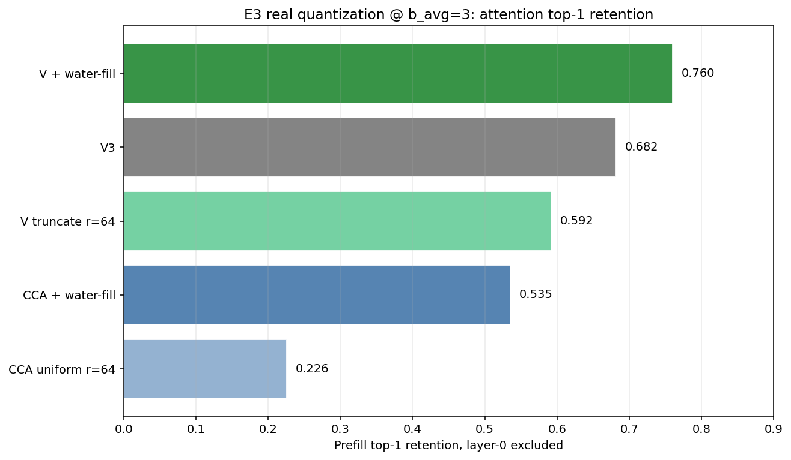
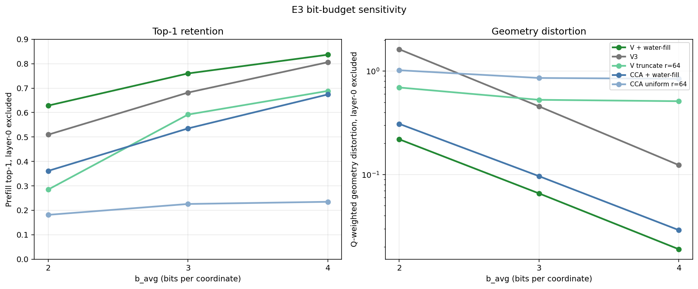
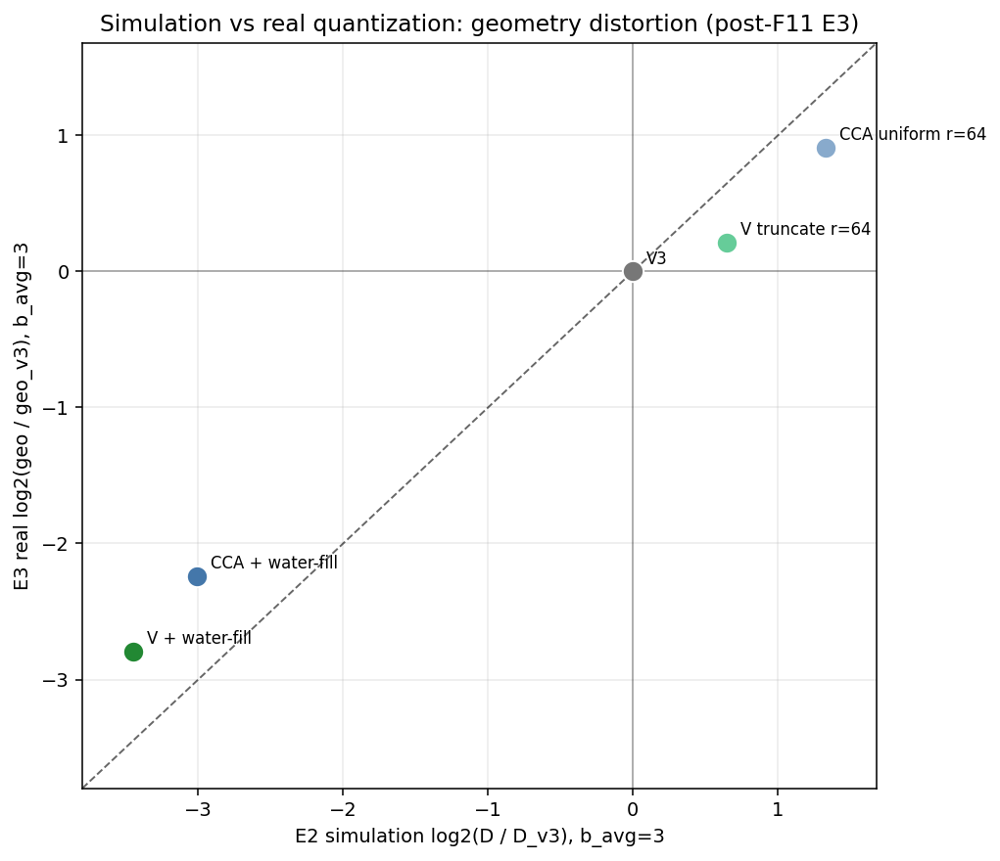
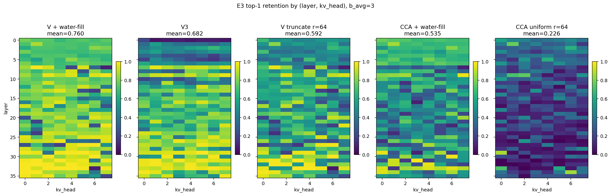
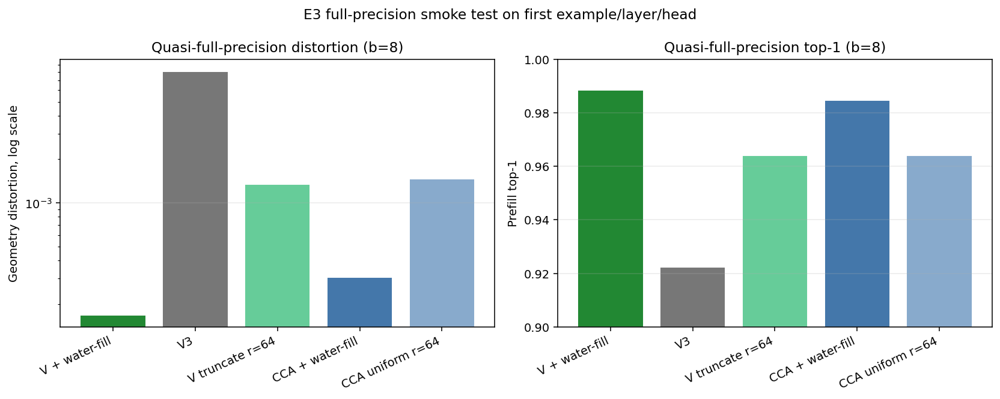

# E3: Real Per-Coordinate Quantization

> Part of the Stage 1E (CCA vs water-filling) study. Builds on [E1](e1_canonical_correlation_spectrum.md)'s CCA basis and [E2](e2_closed_form_simulation.md)'s closed-form rate-distortion simulation.

## 1. Problem formulation

E2 predicts Q-weighted distortion using Bennett's high-rate scalar-quantization approximation. E3 is the first real-compression test: take the actual prefill keys from the 24-example LongBench-E bundle, quantize them with the proposed `(basis x allocation)` methods, reconstruct the keys, and evaluate the resulting attention logits against the original queries.

The questions are:

- **Q1 - Winner under real quantization.** Which method preserves prefill attention top-1 best at matched `b_avg`?
- **Q2 - Simulation calibration.** Does corrected E2 geometry-distortion prediction match the real quantizer's geometry distortion?
- **Q3 - Metric alignment.** Does lower Q-weighted geometry distortion translate into higher top-1 retention?
- **Q4 - Transform correctness.** Does the explicit `forward_map` / `inverse_map` convention handle non-orthogonal CCA maps without silently corrupting reconstruction?

E3 evaluates the same five headline methods at `b_avg in {2, 3, 4}` and rank `r = 64` for truncate/uniform methods:

| Method | Basis | Allocation |
|---|---|---|
| `v3` | random Hadamard rotation + unit-normalization | uniform integer bits |
| `v_truncate` | V eigenbasis of `M_q = E[qq^T]` | top-64 coords only, uniform integer bits |
| `v_waterfill` | V eigenbasis | water-fill on `lambda_j * sigma_j^2(V)` |
| `cca_uniform` | CCA key projection `P_K` | top-64 coords only, uniform integer bits |
| `cca_waterfill` | CCA key projection `P_K` | water-fill on `diag((P_K_inv)^T Sigma_Q P_K_inv)_j * sigma_j^2(CCA)` |

> **F11 status:** the original E3/E4/E5 `cca_waterfill` artifacts used the old `rho^2` allocation. The compressor now uses the trace-formula allocation, and `cca_waterfill` was rerun into `*_f11` artifact directories and merged back into the canonical E3/E4 summaries. The `v3`, `v_truncate`, `v_waterfill`, and `cca_uniform` rows are unchanged.

## 2. Proposed approach

For every example, layer, and kv head, E3 compresses the prefill key matrix `K_pre` and compares the reconstructed matrix `K_hat` to the original under both geometry and attention-rank metrics.

The measured geometry distortion is:

```
E[(k - k_hat)^T M_q (k - k_hat)] / d
```

where `M_q` is the per-kv-head query second moment from E1's pooled calibration. This is the real-quantizer counterpart of E2's simulated Q-weighted distortion.

The attention metrics use the original prefill queries and compare logits:

```
real_logits   = q @ K_pre^T / sqrt(d)
approx_logits = q @ K_hat^T / sqrt(d)
```

Then E3 reports logit MSE, top-1 argmax retention, top-5 containment, and logit cosine. The canonical runs were launched with `query_phase=both`, so decode-phase metrics are present in the same row files; this note focuses on prefill metrics, and E5 reviews decode separately.

## 3. Setup and code

### Driver path

The E3 runner loads global E1 calibration from `cca_stats.pt` and uses it directly for phase `e3` / `e5` ([run_cca_vs_waterfill_study.py:397-408](../../../experiments/stage1/run_cca_vs_waterfill_study.py#L397-L408)). For each payload it slices post-RoPE tensors into prefill queries, decode queries, and prefill keys via `split_prefill_and_decode` ([run_cca_vs_waterfill_study.py:447-470](../../../experiments/stage1/run_cca_vs_waterfill_study.py#L447-L470), [moments.py:26-48](../../../experiments/stage1/toolkit/moments.py#L26-L48)).

`evaluate_method_on_example` builds either the V3 baseline compressor or a per-coordinate compressor, reconstructs prefill keys, computes geometry distortion, and then computes attention metrics ([run_cca_vs_waterfill_study.py:235-305](../../../experiments/stage1/run_cca_vs_waterfill_study.py#L235-L305)).

Aggregation is per method, with per-layer means plus all-layer and layer-0-excluded means; bootstrap CIs are computed over examples for the headline top-1 metric ([run_cca_vs_waterfill_study.py:593-653](../../../experiments/stage1/run_cca_vs_waterfill_study.py#L593-L653)).

### Quantizer path

`PerCoordCompressor` applies:

1. Optional row-vector transform: `transformed = states @ forward_map`.
2. Per-coordinate Lloyd-Max scalar quantization using Gaussian centroids scaled by the coordinate std.
3. Optional inverse row-vector transform: `recon = quantized @ inverse_map`.

The map convention is documented in [per_coord_quantization.py:42-64](../../../experiments/stage1/toolkit/per_coord_quantization.py#L42-L64) and implemented in [per_coord_quantization.py:122-152](../../../experiments/stage1/toolkit/per_coord_quantization.py#L122-L152).

For V methods, `forward_map = V` and `inverse_map = V.T`, with `V` orthogonal. For CCA methods, `P_K` maps column vectors `k_col -> canonical_col`, so row-vector code must use:

```
forward_map = P_K.T
inverse_map = P_K_inv.T
```

This is the correct pairing because:

```
(k_row @ P_K.T) @ P_K_inv.T
= k_row @ (P_K_inv @ P_K).T
~= k_row
```

Manual identity check during this review: across all 288 heads, `max_abs(P_K_inv @ P_K - I) = 1.31e-4` (worst layer 29, kv_head 6), median per-head max abs error `9.32e-6`, 95th percentile `3.84e-5`. The row-vector pairing has the same worst-case error.

### Metrics

Attention metrics are computed in [eval.py:11-38](../../../experiments/stage1/toolkit/eval.py#L11-L38). Geometry distortion is computed in [eval.py:41-48](../../../experiments/stage1/toolkit/eval.py#L41-L48).

All headline numbers below follow the Stage 1 convention: **layer 0 excluded**.

## 4. Results

Canonical artifacts:

- `artifacts/stage1/cca_vs_waterfill_study/e3/e3_b2_r64_summary.json`
- `artifacts/stage1/cca_vs_waterfill_study/e3/e3_b3_r64_summary.json`
- `artifacts/stage1/cca_vs_waterfill_study/e3/e3_b4_r64_summary.json`

### Chart 1 - Top-1 retention at b_avg=3



**Key takeaway:** after the F11 rerun, `v_waterfill` remains the clear real-quantization winner at `0.760` top-1 retention, beating V3 by `+7.8 pp` and corrected `cca_waterfill` by `+22.5 pp`. Corrected `cca_waterfill` now has strong geometry distortion (`0.0965`, about `4.7x` below V3) but still lags V3 on top-1 by `14.7 pp`, so the practical winner is still V-waterfill.

| Method | top-1 up | top-5 up | geo distortion down | logit MSE down |
|---|---:|---:|---:|---:|
| **`v_waterfill`** | **0.760** | **0.937** | **0.0658** | **0.0660** |
| `v3` | 0.682 | 0.906 | 0.4561 | 0.4569 |
| `v_truncate` | 0.592 | 0.856 | 0.5279 | 0.5368 |
| `cca_waterfill` | 0.535 | 0.762 | 0.0965 | 0.0967 |
| `cca_uniform` | 0.226 | 0.414 | 0.8585 | 0.8634 |

### Chart 2 - Bit-budget sensitivity



**Key takeaway:** `v_waterfill` wins at every bit budget. The top-1 gap over V3 shrinks as `b_avg` rises (`+11.9 pp` at 2 bits, `+7.8 pp` at 3 bits, `+3.1 pp` at 4 bits), which is expected as uniform V3 gets enough precision to reduce allocation mistakes.

| `b_avg` | `v_waterfill` top-1 | `v3` top-1 | gap |
|---:|---:|---:|---:|
| 2 | 0.629 | 0.510 | +11.9 pp |
| 3 | 0.760 | 0.682 | +7.8 pp |
| 4 | 0.837 | 0.806 | +3.1 pp |

Geometry ratios versus V3:

| `b_avg` | `v_waterfill` | `cca_waterfill` | `v_truncate` | `cca_uniform` |
|---:|---:|---:|---:|---:|
| 2 | 0.135x | 0.190x | 0.427x | 0.627x |
| 3 | 0.144x | 0.212x | 1.158x | 1.882x |
| 4 | 0.154x | 0.235x | 4.141x | 6.820x |

### Chart 3 - Simulation vs real geometry distortion



**Key takeaway:** corrected E2 now lines up well with post-F11 real E3 for both water-fill methods. `v_waterfill` is close in magnitude (`-3.45` sim vs `-2.79` real), and corrected `cca_waterfill` is also directionally and roughly quantitatively aligned (`-3.01` sim vs `-2.24` real). The remaining gap is consistent with Bennett/Lloyd-Max approximation and small implementation convention differences, not with the earlier F8/F11 formula mismatch.

| Method | E2 sim `log2(D/D_v3)` | E3 real `log2(geo/geo_v3)` |
|---|---:|---:|
| `v_waterfill` | -3.45 | -2.79 |
| `cca_waterfill` | -3.01 | -2.24 |
| `v_truncate` | +0.65 | +0.21 |
| `cca_uniform` | +1.33 | +0.91 |

### Chart 4 - Per-(layer, kv_head) top-1 heatmap



**Key takeaway:** the ranking is not caused by a small number of pathological heads. `v_waterfill` improves top-1 broadly across layers and kv heads. Corrected `cca_waterfill` improves substantially over the stale `rho^2` artifact but remains below V3 and V-waterfill on attention top-1 across most non-layer-0 heads.

### Chart 5 - Quasi-full-precision smoke test



**Key takeaway:** at `b=8` on the first example/layer/head, all non-V3 per-coordinate methods reconstruct nearly perfectly and exceed `0.95` top-1. This supports the transform/inverse-map implementation. V3 remains lower because its design intentionally unit-normalizes before quantization, losing some radial information even at high scalar precision.

| Method | smoke geo | smoke top-1 |
|---|---:|---:|
| `v_waterfill` | 0.000168 | 0.9886 |
| `v3` | 0.008105 | 0.9224 |
| `v_truncate` | 0.001346 | 0.9640 |
| `cca_waterfill` | 0.000307 | 0.9847 |
| `cca_uniform` | 0.001465 | 0.9641 |

## 5. Analysis

### Q1 - Which method wins under real quantization?

In the post-F11 artifacts, `v_waterfill` wins cleanly on attention top-1 at all three bit budgets. At `b_avg=3`, it reduces geometry distortion by about `6.9x` relative to V3 and improves top-1 by `7.8 pp`.

Corrected `cca_waterfill` reduces geometry distortion by about `4.7x` relative to V3 at `b_avg=3`, but its top-1 is only `0.535`, below V3's `0.682` and V-waterfill's `0.760`. That makes the final practical ranking: `v_waterfill` wins; CCA-waterfill is geometry-good but attention-rank fragile.

### Q2 - Does corrected E2 predict E3?

For V-basis methods, yes. After F8, E2 predicts:

```
v_waterfill > cca_waterfill > V3 > v_truncate > cca_uniform
```

on geometry distortion at `b_avg=3`. E3's geometry ranking is:

```
v_waterfill > cca_waterfill > V3 > v_truncate > cca_uniform
```

The V-waterfill prediction is close: E2 predicts `-3.45 log2` relative to V3 and E3 measures `-2.79 log2`. Corrected CCA-waterfill is also much closer after F11: E2 predicts `-3.01 log2` and E3 measures `-2.24 log2`. V-truncate and CCA-uniform remain directionally correct.

### Q3 - Does lower geometry distortion always imply higher top-1?

No. E3 repeats the Stage 1D lesson: Q-weighted distortion is useful, but it is not the production metric.

At `b_avg=3`, corrected `cca_waterfill` has much lower geometry distortion than V3 (`0.0965` vs `0.4561`) but worse top-1 (`0.535` vs `0.682`). At `b_avg=2`, both `v_truncate` and corrected `cca_waterfill` have lower geometry distortion than V3 but lose badly on top-1. The likely mechanism is structured residual: CCA's non-orthogonal transform can make small Q-weighted reconstruction error translate into coherent rank changes, while V3's random rotation errors are more diffuse.

`v_waterfill` is the safe case because geometry and top-1 agree: it improves both.

### Q4 - Are the forward/inverse maps sound?

Yes for current artifacts. The code passes CCA's non-orthogonal inverse explicitly, and the matrix identity check is within expected float32 SVD precision. The quasi-full-precision smoke test independently supports the same conclusion.

The remaining issue is gate coverage, not current result correctness: E3's gate should assert the identity explicitly so a future regression cannot silently masquerade as a CCA method failure. This is tracked as F9 in [fixes_to_apply.md](fixes_to_apply.md).

### V3 Stage 1D sanity check

The manual cross-check against Stage 1D's `oracle_partial_spectrum_study/metrics.json` passes:

| `b_avg` | E3 V3 geo | Stage 1D baseline geo | Relative diff |
|---:|---:|---:|---:|
| 2 | 1.6263 | 1.6972 | -4.18% |
| 3 | 0.4561 | 0.4727 | -3.51% |
| 4 | 0.1236 | 0.1276 | -3.09% |

The E3 gate currently does not enforce this because it parses the legacy file at the wrong level; tracked as F10.

## 6. Caveats and known issues

| Issue | Severity | Status |
|---|---|---|
| Real `cca_waterfill` artifacts were originally generated with pre-F8 `rho^2` instead of trace-formula weights. | P1 | F11 code applied, verified, rerun for E3/E4/E5, and merged into canonical artifacts. |
| E3 gate lacks explicit `P_K_inv @ P_K` / row-vector identity assertion for CCA maps. | P2 | Open as F9. Current artifacts manually verified sound. |
| E3 gate does not enforce the Stage 1D V3 cross-check despite documenting it. | P3 | Open as F10. Manual check passes within 5%. |
| Bootstrap CI is example-level and currently includes layer 0, while the headline mean excludes layer 0. | P3 | Open as F12. Reporting-only; all canonical methods/runs have CIs, but CI centers should not be plotted as l0excl CIs until fixed. |
| Decode metrics are present in E3 row files because `query_phase=both`. | informational | Deferred to E5 review. |

## 7. Implications for downstream

- Use `v_waterfill` as the current Stage 3 candidate basis/allocation design. It is simpler than CCA, cheaper to calibrate, backend-friendly because the transform is orthogonal, and wins the post-F11 real E3 comparison.
- Do not use CCA-uniform as proposed. It loses to V3 on both geometry and top-1 at `b_avg=3` and `4`.
- Treat CCA-waterfill as an instructive but not production-favorable result: the corrected trace-formula allocation fixes the simulation-vs-real mismatch and greatly improves geometry, but it still underperforms V3 and V-waterfill on top-1 retention.
- Keep corrected E2 as a screening tool, but verify aggressive zero-bit allocations with an E3-style real quantizer before making claims.

## 8. Artifacts

### Charts

Regenerate with:

```bash
python experiments/stage1/scripts/make_e3_charts.py
```

Outputs:

- `artifacts/stage1/cca_vs_waterfill_study/report_charts/e3_top1_b3.png`
- `artifacts/stage1/cca_vs_waterfill_study/report_charts/e3_bit_budget_sensitivity.png`
- `artifacts/stage1/cca_vs_waterfill_study/report_charts/e3_sim_vs_real_geo.png`
- `artifacts/stage1/cca_vs_waterfill_study/report_charts/e3_top1_heatmap_b3.png`
- `artifacts/stage1/cca_vs_waterfill_study/report_charts/e3_smoke_test.png`

### Underlying data

- `artifacts/stage1/cca_vs_waterfill_study/e3/e3_b{2,3,4}_r64_summary.json`
- `artifacts/stage1/cca_vs_waterfill_study/e3/e3_b{2,3,4}_r64_rows.pt`
- `artifacts/stage1/cca_vs_waterfill_study/e3/e3_b{2,3,4}_r64_smoke_b16.json` (the filename says `b16`, but the runner uses `smoke_bits = 8.0` to avoid V3 codebook blow-up)
- `artifacts/stage1/cca_vs_waterfill_study/metrics_e1_e2.json` for corrected E2 simulation comparison

### Code

- `experiments/stage1/run_cca_vs_waterfill_study.py` - E3/E4/E5 runner
- `experiments/stage1/toolkit/per_coord_quantization.py` - real per-coordinate quantizer
- `experiments/stage1/toolkit/eval.py` - geometry and attention metrics
- `experiments/stage1/scripts/make_e3_charts.py` - chart regeneration
