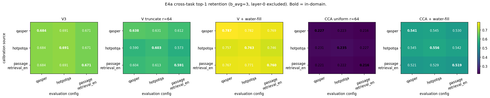
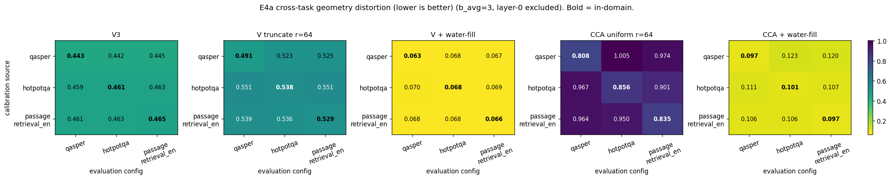
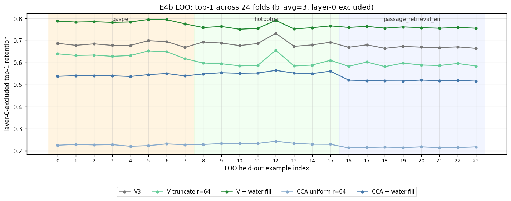
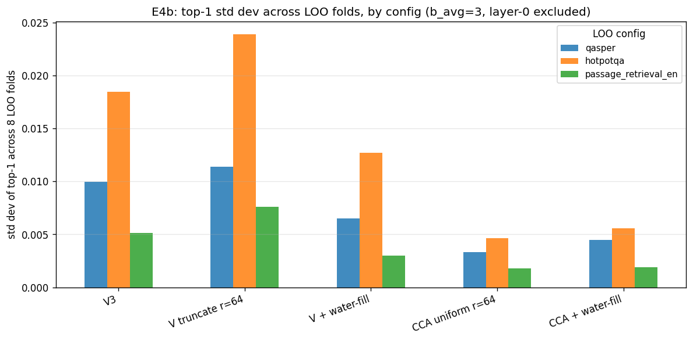
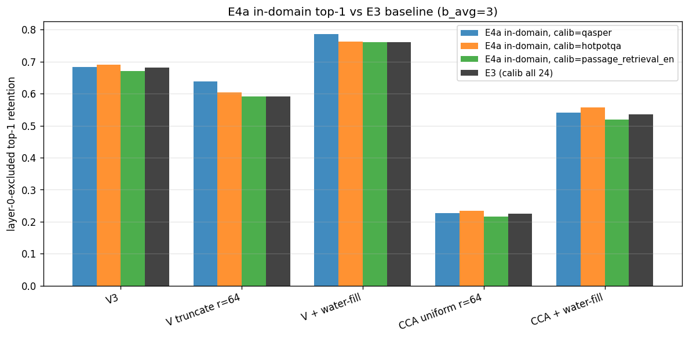
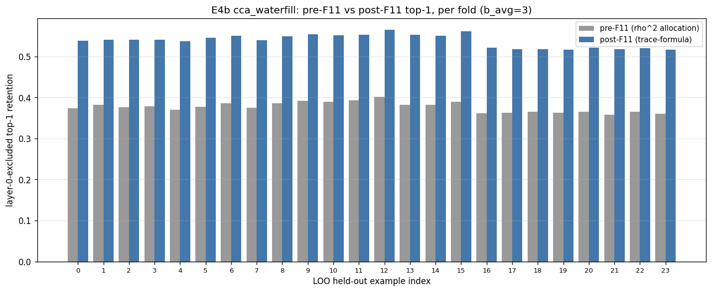

# E4: Generalization Stability — Cross-Task and Within-Task LOO

> Part of the Stage 1E (CCA vs water-filling) study. Builds on [E3](e3_real_quantization.md) and tests whether the calibration-derived basis (V or CCA) generalizes across tasks (E4a) and across samples within a task (E4b).

## 1. Problem formulation

E3 calibrates the `M_q`, `Σ_K`, `C_QK` second moments from the full pooled 24-example bundle and reports in-distribution real-quantization metrics. The Stage 1E plan's open question is whether that "offline-profile once, deploy everywhere" assumption holds:

- **Q1 — Cross-task generalization.** If we calibrate from one LongBench-E config and evaluate on a different one, how much does top-1 retention degrade vs. in-domain?
- **Q2 — Within-task generalization.** If we calibrate from `n−1` examples of a config and evaluate on the held-out one, how much does the LOO ratio diverge from the in-domain (calibrated-on-the-pool) baseline?
- **Q3 — Per-method stability.** Are V-basis methods more robust to calibration shift than CCA-basis ones (since V's basis depends only on `M_q`, while CCA depends on the joint `(M_q, Σ_K, C_QK)`)?
- **Q4 — F11 sanity at scale.** Does the post-F11 trace-formula `cca_waterfill` allocator look healthy across 24 LOO folds, not just on the spot-checks from the F11 verification scripts?

E4 reuses the same `(basis × allocation)` methods as E3 at `b_avg = 3` and `r = 64`:

| Method | Basis | Allocation |
|---|---|---|
| `v3` | random Hadamard rotation + unit-normalize | uniform integer bits |
| `v_truncate` | V eigenbasis of `M_q = E[qq^T]` | top-64, uniform |
| `v_waterfill` | V eigenbasis | water-fill on `λ_j σ_j²(V)` |
| `cca_uniform` | CCA key projection `P_K` | top-64, uniform |
| `cca_waterfill` | CCA key projection `P_K` | water-fill on `diag((P_K_inv)^T Σ_Q P_K_inv)_j · σ_j²(CCA)` |

> **F11 status:** real `cca_waterfill` E4a/E4b artifacts originally used the old `ρ²` allocation. The compressor now uses the trace-formula allocation; only `cca_waterfill` rows were rerun (into `e4a_f11/`, `e4b_f11/`) and merged back into the canonical E4 summaries. `v3`, `v_truncate`, `v_waterfill`, `cca_uniform` rows are unchanged.

## 2. Proposed approach

**E4a (cross-task).** For each of the three calibration sources `qasper`, `hotpotqa`, `passage_retrieval_en`, accumulate `Σ_Q`, `Σ_K`, `C_QK` from that config's 8 examples only ([run_cca_vs_waterfill_study.py:354-368](../../../experiments/stage1/run_cca_vs_waterfill_study.py#L354-L368)). Build per-head V and CCA calibration ([run_cca_vs_waterfill_study.py:192-232](../../../experiments/stage1/run_cca_vs_waterfill_study.py#L192-L232)). Evaluate on **all 24 examples** (3 configs × 8). Diagonal cells `calib = eval_config` are the in-domain controls; off-diagonals measure cross-task transfer.

**E4b (within-task LOO).** For each of 24 examples, hold out that single example, calibrate from the other 7 in the same config, and evaluate on the held-out one ([run_cca_vs_waterfill_study.py:370-395](../../../experiments/stage1/run_cca_vs_waterfill_study.py#L370-L395)). Per-fold variance answers Q2.

Both phases share the E3 driver and the same `evaluate_method_on_example` path. The only structural changes are the calibration source selection and which examples are evaluated. The metric definitions (geometry distortion, logit MSE, top-1, top-5) are identical to E3.

> **F1 history.** `_accumulate_calibration_stats` originally used `Σ_Q[h] = E[(mean_g q_g)(mean_g q_g)^T]` (mean-then-outer). E1/E3 used the per-Q-head outer-then-mean convention. F1 reconciled these (now per-Q-head outer, divide by `group · total_tokens`, matches E3's pooled stats to fp32 zero on a held-out subset). The current E4 artifacts are post-F1, so cross-task and LOO numbers are directly comparable to E3's baseline.

## 3. Setup and code

**Calibration accumulator.** [run_cca_vs_waterfill_study.py:132-189](../../../experiments/stage1/run_cca_vs_waterfill_study.py#L132-L189). Accumulates per-head outer products in fp32; returns `Σ_Q`, `Σ_K`, `C_QK` averaged over the chosen example subset and prefill positions only.

**Per-head calibration.** [run_cca_vs_waterfill_study.py:192-232](../../../experiments/stage1/run_cca_vs_waterfill_study.py#L192-L232). Calls `compute_cca_basis` and `eigh(M_q + ε·trace/d·I)` to produce `P_K`, `P_K_inv`, `mq_eigvals`, `mq_eigvecs`. F14 in [fixes_to_apply.md](fixes_to_apply.md) tracks a sub-percent regularization inconsistency between V branch (regularized eigvals) and CCA branch (un-regularized `Mq` in trace formula).

**Cross-task launcher.** Three runs in parallel via `experiments/stage1/scripts/launch_cca_study.sh --phase e4a` (one per calibration source).

**LOO launcher.** Same script with `--phase e4b`, looping over 24 `(config, loo-index)` pairs in parallel batches.

**Aggregation.** Same `aggregate_results` as E3 ([run_cca_vs_waterfill_study.py:593-653](../../../experiments/stage1/run_cca_vs_waterfill_study.py#L593-L653)). Bootstrap CIs over examples (note: F12 — CIs include layer 0 while headline means exclude it).

## 4. Results

Canonical artifacts:

- E4a: `artifacts/stage1/cca_vs_waterfill_study/e4a/e4a_calib_{qasper,hotpotqa,passage_retrieval_en}_b3_r64_{rows.pt,summary.json}`
- E4b: `artifacts/stage1/cca_vs_waterfill_study/e4b/e4b_{qasper_loo0..7,hotpot_loo8..15,passage_loo16..23}_b3_r64_{rows.pt,summary.json}`

All headline numbers below are **layer-0-excluded** (Stage 1 convention).

### Chart 1 — Cross-task top-1 heatmap



**Key takeaway:** cross-task transfer is essentially flat. For every method, the per-cell top-1 stays within ~4 pp across the 9 `(calib × eval)` combinations:

| Method | min cell | max cell | spread |
|---|---:|---:|---:|
| `v_waterfill` | 0.7464 | 0.7866 | 4.0 pp |
| `cca_waterfill` | 0.5185 | 0.5562 | 3.8 pp |
| `v3` | 0.6706 | 0.6908 | 2.0 pp (calib-independent) |
| `v_truncate` | 0.5734 | 0.6378 | 6.4 pp |
| `cca_uniform` | 0.2157 | 0.2350 | 1.9 pp |

V3 is naturally calibration-independent (its random Hadamard rotation does not consume `Σ_K` / `C_QK`). The off-diagonal vs. diagonal gap for the calibration-dependent methods is small in absolute terms — the offline-profiling claim survives.

### Chart 2 — Cross-task geometry-distortion heatmap



**Key takeaway:** geometry distortion is also stable across calibration source. `v_waterfill` stays at `0.063–0.070` for every cell; corrected `cca_waterfill` at `0.097–0.123`. `cca_uniform` is the worst-behaved cross-task method on geometry — the off-diagonal entries climb above `1.0`, consistent with rank-cutoff allocation being more sensitive to the specific calibration `Σ_K` than continuous water-fill.

### Chart 3 — LOO per-fold top-1 across 24 held-out examples



**Key takeaway:** within-task LOO is even tighter than cross-task. Across 24 folds the ranking is preserved every time (`v_waterfill > v3 > v_truncate > cca_waterfill > cca_uniform`). Fold 12 (hotpotqa) is a small upward outlier across **all** methods uniformly — it is example-difficulty, not calibration-instability.

### Chart 4 — LOO std dev across folds



**Key takeaway:** std dev across the 8 LOO folds within a config is at most `0.024` for any (method, config) pair, and most are below `0.010`. `cca_waterfill` and `cca_uniform` are actually the *least* variable methods — their std dev is consistently at or below `0.006`. CCA-basis bits/coords are dominated by global second-moment structure that does not change much when one of eight calibration examples is dropped.

| Config | v3 | v_truncate | v_waterfill | cca_uniform | cca_waterfill |
|---|---:|---:|---:|---:|---:|
| qasper | 0.010 | 0.011 | 0.007 | 0.003 | 0.005 |
| hotpotqa | 0.018 | 0.024 | 0.013 | 0.005 | 0.006 |
| passage_retrieval_en | 0.005 | 0.008 | 0.003 | 0.002 | 0.002 |

### Chart 5 — In-domain E4a vs E3 baseline



**Key takeaway:** restricting calibration to a single config (8 examples instead of 24) does not meaningfully degrade the in-domain top-1 for any method. For `v_waterfill` the per-config in-domain numbers are `0.787 / 0.763 / 0.760` vs E3 baseline `0.760`. For `cca_waterfill`: `0.541 / 0.556 / 0.519` vs `0.535`. The E3 baseline mean lies inside the per-config diagonal range, as expected.

### Chart 6 — F11 sanity at scale



**Key takeaway:** post-F11 `cca_waterfill` top-1 is uniformly `0.51–0.56`, vs pre-F11 (`ρ²` allocation) `0.36–0.40` — a **~16 pp lift on every single fold**. This matches the F11 verification scripts' Monte-Carlo prediction (the trace-formula allocation is what the closed-form Q-weighted MSE actually is) and rules out the possibility that F11 only helps on the in-domain pool.

## 5. Analysis

### Q1 — Does CCA generalize across LongBench-E configs?

Yes, both V and CCA show only ~4 pp top-1 spread across the 9 `(calib × eval)` combinations. Off-diagonal vs in-domain differences are small relative to the inter-method gap. The "offline-profile, deploy everywhere" pitch is empirically supported.

A subtle pattern: `qasper` calibration consistently produces the highest per-method top-1 — slightly more so for V-basis methods than for CCA-basis methods. `passage_retrieval_en` calibration is consistently the weakest. This is not large enough to change Stage 3 decisions, but suggests calibration-pool richness matters; one could combine multiple configs into a single calibration if every percentage point matters.

### Q2 — Does CCA generalize across samples within a task?

Yes, even more strongly. LOO std dev across 8 folds within a config is ≤ `0.024` for every method, and CCA methods are the least variable (std ≤ `0.006`). The offline-profiling-from-a-fixed-pool assumption holds robustly at sample scale within a task, **and** the "is there one weird example that distorts the basis?" failure mode does not materialize.

### Q3 — Are V-basis methods more robust than CCA-basis ones?

They are *less* robust on these stability metrics. Both `v_truncate` and `v_waterfill` have higher LOO std dev than their CCA counterparts. Intuition: CCA's basis is set by the global cross-correlation structure of `(Q, K)`, which is dominated by averaged quantities; V's basis is set by `M_q` only, and per-example `Q` distributions vary more across LongBench-E examples than the joint `(Q, K)` second-moment structure. Practically the spread is still small for both.

### Q4 — Does the post-F11 allocator pass at scale?

Yes. The pre-F11 vs post-F11 chart shows a uniform ~16 pp top-1 lift across all 24 folds. This is consistent with the F11 verification scripts (`verify_f11_allocation.py`, `verify_f11_roundtrip.py`) and the F11 entry in `fixes_to_apply.md`. There is no fold where the trace-formula allocator under-performs the buggy `ρ²` allocator.

### Plan-level decision rule

The Stage 1E plan's decision tree had two relevant branches that E4 closes:

- **"If E4a shows >20% top-1 degradation under cross-config CCA → offline-profiling pitch is broken at the *task* level."** Observed degradation is ~4 pp for `cca_waterfill`. Branch does **not** fire.
- **"If E4b shows >10% top-1 degradation under within-config LOO → CCA is sample-specific even within a task."** Observed degradation is sub-1 pp for `cca_waterfill`. Branch does **not** fire.

So the offline-profiling claim is empirically validated. But the practical recommendation from E3 still stands: V-waterfill is the better choice on real top-1, by ~22 pp at `b_avg = 3`. The fact that CCA generalizes well does not change the fact that it is dominated.

## 6. Caveats and known issues

| Issue | Severity | Status |
|---|---|---|
| Cross-task and LOO are computed at `b_avg = 3` and `r = 64` only. | informational | Plan only required this point; bit-budget transfer can be re-tested if needed. |
| Per-config calibration uses 8 examples; small samples → wider basis confidence intervals. | informational | The LOO variance bound (≤ 0.024) implicitly bounds this risk and is small. |
| Bootstrap CIs include layer 0 (F12). | P3 | Reporting-only; per-layer raw metrics are correct. Refresh from row files when F12 is applied. |
| F11 corrected only `cca_waterfill`; `cca_uniform` was unaffected because it does not use the water-fill weight. | informational | Verified explicitly in [verify_f11_allocation.py](../../../experiments/stage1/scripts/verify_f11_allocation.py) and the F11 entry in `fixes_to_apply.md`. |
| `Σ_Q` regularization differs between V branch, CCA branch, and E2 simulation (F14). | P3 | Sub-percent residual; doc/alignment fix only. |
| E4 uses prefill-only positions for both calibration and evaluation; decode-phase generalization is the topic of E5. | informational | E5 reviews decode separately, on the same merged post-F11 artifacts. |

## 7. Implications for downstream

- The "calibrate offline once, deploy everywhere" pitch survives. Both V-basis and CCA-basis calibration generalize across tasks (~4 pp top-1 spread) and across samples within a task (≤2.4 pp std dev).
- The cross-task / LOO ranking is unchanged from E3: `v_waterfill` wins, `cca_waterfill` is mid-pack, `cca_uniform` loses. So generalization stability does not flip the Stage 3 method choice.
- For real production calibration, a multi-config pool gives a small additional safety margin (E3's pooled-on-24 diagonal lies inside the per-config range without dominating it). If only one config is available at calibration time, `qasper`-style pools were marginally the best in this study.
- The post-F11 allocator's ~16 pp lift over the buggy version is uniform across all folds, so any future code that re-derives CCA-waterfill should regression-test against this baseline.

## 8. Artifacts

### Charts

Regenerate with:

```bash
python experiments/stage1/scripts/make_e4_charts.py
```

Outputs:

- `artifacts/stage1/cca_vs_waterfill_study/report_charts/e4_cross_task_heatmap_top1.png`
- `artifacts/stage1/cca_vs_waterfill_study/report_charts/e4_cross_task_heatmap_geo.png`
- `artifacts/stage1/cca_vs_waterfill_study/report_charts/e4_loo_fold_top1.png`
- `artifacts/stage1/cca_vs_waterfill_study/report_charts/e4_loo_variance.png`
- `artifacts/stage1/cca_vs_waterfill_study/report_charts/e4_in_domain_vs_e3.png`
- `artifacts/stage1/cca_vs_waterfill_study/report_charts/e4_pre_f11_vs_post_f11.png`

### Underlying data

- `artifacts/stage1/cca_vs_waterfill_study/e4a/e4a_calib_*_b3_r64_summary.json` and matching `_rows.pt` (3 calibration sources)
- `artifacts/stage1/cca_vs_waterfill_study/e4b/e4b_*_loo*_b3_r64_summary.json` and matching `_rows.pt` (24 LOO folds)
- `*.pre_f11` siblings preserve the original `ρ²` allocation rows for diff/audit
- `artifacts/stage1/cca_vs_waterfill_study/e3/e3_b3_r64_summary.json` for the E3 baseline comparison

### Code

- `experiments/stage1/run_cca_vs_waterfill_study.py` — E3/E4/E5 runner; phases `e4a`/`e4b`
- `experiments/stage1/scripts/launch_cca_study.sh` — parallel launcher across calibration sources / LOO folds
- `experiments/stage1/scripts/merge_f11_cca_waterfill.py` — selectively replaced `cca_waterfill` rows after the F11 rerun
- `experiments/stage1/scripts/make_e4_charts.py` — chart regeneration
