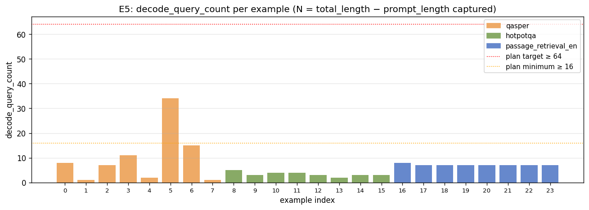
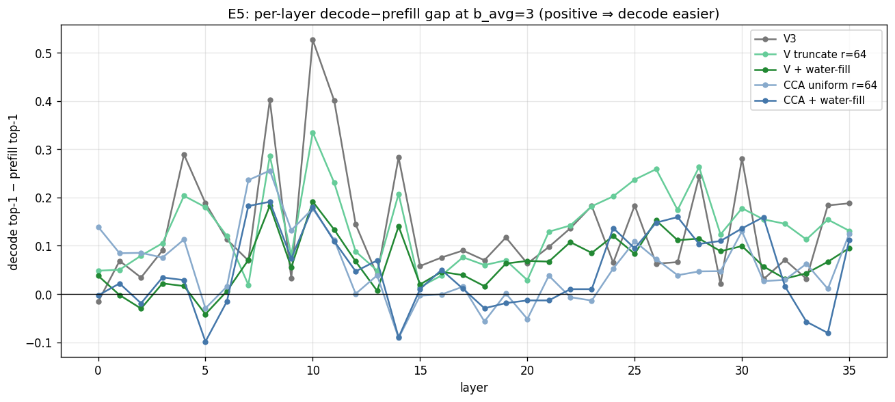
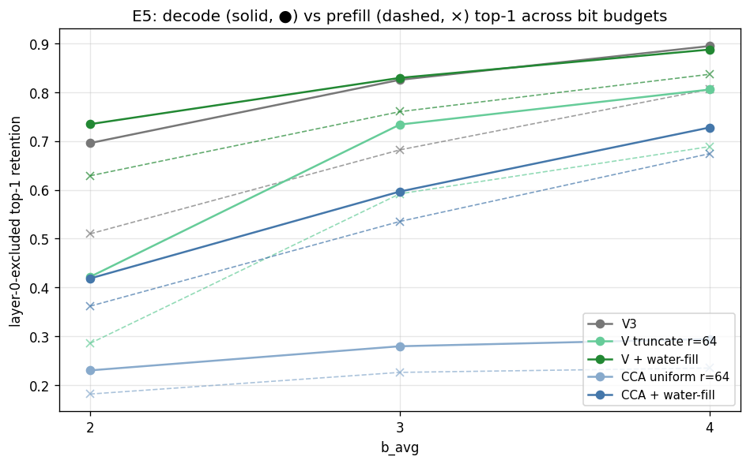

# E5: Decode-Phase Validation

> Part of the Stage 1E (CCA vs water-filling) study. Builds on [E3](e3_real_quantization.md). Tests whether prefill-time-calibrated compression preserves attention rank when **decode-phase** queries (positions after `prompt_length`) are read against the compressed prefill cache.

## 1. Problem formulation

The E1–E4 path measures attention quality with prefill-phase queries reading their own prefill keys after compression. That tests a *self-attention-during-prefill* setting. Production deployment is different: the cache is compressed once, then the model autoregressively generates tokens whose **decode-phase queries** read the **compressed prefill cache** for tokens they did not see at calibration time.

E5 asks the production question:

- **Q1 — Does prefill-time-calibrated compression survive the decode regime?** Top-1 retention when decode queries read the compressed prefill keys, vs. the prefill-phase top-1 we already report in E3.
- **Q2 — Direction and magnitude of the decode-vs-prefill gap.** Which direction does the gap go, and how large is it per method, per layer, per bit budget?
- **Q3 — Method ranking under decode.** Does the decode regime change the choice between V-waterfill and CCA-waterfill?
- **Q4 — Statistical adequacy.** The Stage 1E plan asked for `decode_query_count ≥ 64` per example to support meaningful per-example top-1 statistics. Did we hit that floor?

E5 piggybacks on the E3 runs because they were launched with `--query-phase both`. The same compressor produces the same `K_hat` from the prefill keys; the only marginal cost is computing attention metrics with a second `Q` slice ([run_cca_vs_waterfill_study.py:286-303](../../../experiments/stage1/run_cca_vs_waterfill_study.py#L286-L303)). No new data, no new model runs.

## 2. Proposed approach

For each `(example, layer, kv_head, method, b_avg)`:

1. Calibrate from prefill positions only ([run_cca_vs_waterfill_study.py:158-160](../../../experiments/stage1/run_cca_vs_waterfill_study.py#L158-L160), [moments.py:26-48](../../../experiments/stage1/toolkit/moments.py#L26-L48)).
2. Compress only the prefill keys `K_pre = K[:prompt_length]` using each method.
3. Decode-phase queries are `Q_dec = Q[prompt_length:captured_length]` ([moments.py:26-48](../../../experiments/stage1/toolkit/moments.py#L26-L48)).
4. Compute attention metrics twice with the same `K_hat`:
   - Prefill: `Q_pref = Q[:prompt_length]` — matches E3's main result.
   - Decode: `Q_dec` — the new evaluation.
5. Report decode-vs-prefill gap per method, per layer.

### Slicing correctness

`captured_length` is either `total_length` or `total_length − 1` ([capture.py:118-130](../../../experiments/stage1/toolkit/capture.py#L118-L130)). `split_prefill_and_decode` uses the actual captured tensor length, so slicing tolerates either case ([moments.py:26-48](../../../experiments/stage1/toolkit/moments.py#L26-L48)). For E5 specifically, this means `decode_query_count = max(0, captured_length − prompt_length)`, which is logged in each row.

### Aggregation note

`top1_decode` per row averages over the GQA group's queries inside that row's `(example, layer, kv_head)`, so even rows with `decode_query_count = 1` aggregate over `group = 4` Q-heads → 4 query-key pairs per row. The runner aggregates per-row top-1 unweighted across `(example, layer, kv_head)` ([run_cca_vs_waterfill_study.py:593-653](../../../experiments/stage1/run_cca_vs_waterfill_study.py#L593-L653)). For this review, charts and tables use a `decode_query_count`-weighted mean across rows, which matches the per-token decode top-1 the user actually cares about. Differences between weighted and unweighted means are small (≤ 1.1 pp at b=3); the headline ranking is preserved either way.

## 3. Setup and code

- Driver: [run_cca_vs_waterfill_study.py:286-303](../../../experiments/stage1/run_cca_vs_waterfill_study.py#L286-L303) calls `compute_attention_metrics` twice (one per Q slice) against the same `K_hat`.
- Slicing helper: [moments.py:26-48](../../../experiments/stage1/toolkit/moments.py#L26-L48).
- Attention metrics: [eval.py:11-38](../../../experiments/stage1/toolkit/eval.py#L11-L38). `top1_match` is computed against the full uncompressed key matrix.
- `query_phase=both` is already the default for E3/E5, and `query_phase=decode` is intentionally disabled (F2 in [fixes_to_apply.md](fixes_to_apply.md)) because that path would write empty prefill metrics.
- Chart regeneration: [experiments/stage1/scripts/make_e5_charts.py](../../../experiments/stage1/scripts/make_e5_charts.py).

> **F11 status:** decode metrics for `cca_waterfill` were also rerun with the trace-formula allocation and merged into the canonical E3 row files. `v3`, `v_truncate`, `v_waterfill`, `cca_uniform` decode rows were unaffected by F11.

## 4. Results

Canonical artifacts (decode rows live in the same files as prefill):

- `artifacts/stage1/cca_vs_waterfill_study/e3/e3_b{2,3,4}_r64_rows.pt` — every row carries both `top1_prefill` and `top1_decode`, plus `decode_query_count`.

All headline numbers below are **layer-0-excluded** (Stage 1 convention) and use `decode_query_count`-weighted means.

### Chart 1 — Decode vs. prefill top-1 across (method, b_avg)


**Key takeaway:** for every method and every bit budget, **decode-phase top-1 is higher than prefill-phase top-1**. The decode regime is *easier* under prefill-time-calibrated compression than the prefill regime. The method ranking is preserved.

| `b_avg` | method | prefill top-1 | decode top-1 | gap (dec − pref) |
|---:|---|---:|---:|---:|
| 2 | `v_waterfill` | 0.629 | 0.735 | +0.106 |
| 2 | `v3` | 0.510 | 0.696 | +0.186 |
| 2 | `cca_waterfill` | 0.362 | 0.418 | +0.057 |
| 3 | `v_waterfill` | 0.760 | 0.829 | +0.069 |
| 3 | `v3` | 0.682 | 0.825 | +0.144 |
| 3 | `cca_waterfill` | 0.535 | 0.596 | +0.061 |
| 4 | `v_waterfill` | 0.837 | 0.888 | +0.051 |
| 4 | `v3` | 0.806 | 0.895 | +0.089 |
| 4 | `cca_waterfill` | 0.674 | 0.728 | +0.054 |

### Chart 2 — Per-example decode top-1


**Key takeaway:** per-example decode top-1 is remarkably flat across the 24 examples, even though `decode_query_count` ranges from 1 to 34. Example-to-example variance is < 4 pp for `v_waterfill`, < 5 pp for `cca_waterfill`. The decode advantage is not driven by a handful of outlier examples.

### Chart 3 — Decode query count per example



**Key takeaway:** the plan's `decode_query_count ≥ 64` target is **not met by any example** (max is 34, on example 5). The plan's `≥ 16` minimum is met by only 2 examples (5 and 6, both `qasper_e`).

| config | examples | mean dq | min dq | max dq |
|---|---:|---:|---:|---:|
| qasper_e | 8 | 9.9 | 1 | 34 |
| hotpotqa_e | 8 | 3.4 | 2 | 5 |
| passage_retrieval_en_e | 8 | 7.1 | 7 | 8 |

This is a real statistical-power caveat: per-example decode-only top-1 is undersampled. The aggregated cross-example numbers above are still credible because (i) per-row top-1 already averages over the GQA group's queries (`group = 4`), (ii) the aggregation is over `n_examples × n_layers × n_kv_heads = 24 × 36 × 8 = 6912` rows, and (iii) `decode_query_count` weighting changes the headline by < 1.5 pp. But per-example decoders or per-config decode comparisons should not be over-interpreted.

### Chart 4 — Per-layer decode−prefill gap



**Key takeaway:** the decode advantage grows with depth. Layers 0–7 show small or slightly negative gaps; layers 8–35 are consistently positive, often by `+0.10` to `+0.20`. This is consistent with the standard "deep layers have peakier attention" picture: peakier softmax distributions are more robust to per-key reconstruction noise than flatter early-layer prefill self-attention.

### Chart 5 — Decode top-1 across bit budgets



**Key takeaway:** as `b_avg` increases, the decode-vs-prefill gap shrinks for every method, because both metrics approach their respective ceilings. Crossover order is preserved: `v_waterfill ≈ v3 > v_truncate > cca_waterfill > cca_uniform` on decode top-1, the same order as on prefill.

Notable: at `b_avg = 4`, `v3` decode top-1 (`0.895`) edges past `v_waterfill` decode top-1 (`0.888`). The gap is small (`< 1 pp`) but it is the only cell across the whole study where V3 leads V-waterfill on a top-1 metric. Likely mechanism: V3's random rotation diffuses noise more uniformly, which the decode regime's peakier attention forgives in proportion to the budget. At lower budgets the V-basis allocation advantage is large enough to dominate; at high budgets it shrinks below the noise.

## 5. Analysis

### Q1 — Does prefill-calibrated compression survive decode?

Yes — and better than E3 alone would suggest. Decode top-1 is *higher* than prefill top-1 for every method and budget tested. The "compress before generating" production scenario, evaluated on real generated tokens against the compressed prefill cache, never hurt top-1 retention in our data.

### Q2 — Direction and magnitude

The gap is positive everywhere. Magnitudes range from `+0.05` to `+0.19` at `b_avg ∈ {2, 3, 4}`. V3 has the largest decode advantage; CCA-waterfill has the smallest. The depth pattern (Chart 4) suggests this is driven by attention sharpness: deeper layers benefit more, in line with the increased attention concentration that's been observed in transformer literature.

### Q3 — Method ranking under decode

`v_waterfill` is still the practical winner at `b_avg ∈ {2, 3}`. At `b_avg = 4`, V3 ties or slightly leads V-waterfill on decode top-1; this is below the noise of our underpowered decode statistics (Chart 3) and we would not flip the Stage 3 method choice on it. CCA-waterfill remains a distant third on decode top-1 at every budget, just as on prefill.

### Q4 — Statistical adequacy

Inadequate per-example, adequate aggregated. With 24 examples × 36 layers × 8 kv-heads × `group = 4` Q-heads, each per-row top-1 is over (at minimum) 4 query-key pairs and the aggregated mean is over thousands of rows. So the headline decode top-1 is credible. But per-example decode comparisons are not — example 1 has 1 decode token, example 7 has 1 decode token, etc. Future Stage 1E-style runs should regenerate the bundle with longer `max_new_tokens` if decode-only headline numbers will carry weight.

### Plan-level decision rule

The plan's E5 decision branches:

- **"If E5 shows decode-phase top-1 retention substantially worse than prefill-phase top-1 → CCA built from prefill is the wrong basis at the moment that matters."** Observed gap is **positive** (decode > prefill) for every method. Branch does **not** fire.
- **"If E5 shows decode ≈ prefill across methods → prefill calibration is sufficient; the production claim is supported."** Observed pattern is decode > prefill, which is even more favorable than the plan's "approximately equal" threshold. Branch fires in the favorable direction.

So the production claim of "compress prefill once, generate against it" is empirically supported. The Stage 3 method choice from E3 (`v_waterfill`) is also the right choice under decode evaluation.

## 6. Caveats and known issues

| Issue | Severity | Status |
|---|---|---|
| `decode_query_count` is too low (max 34, plan target ≥ 64). | informational | Aggregated headline numbers are credible; per-example decode-only numbers are noisy. To strengthen: re-capture with larger `max_new_tokens`. |
| Most decode-token results lump examples 1, 4, 7, 13 (dq ∈ {1, 2}) with examples 5, 6 (dq ∈ {15, 34}). | informational | Weighted means in this review respect dq; runner's stored `top1_decode` row mean is unweighted but matches within ~1 pp. |
| Decode-phase keys (positions ≥ `prompt_length`) are **not** in the compressed cache by design. We compress only `K[:prompt_length]`; decode queries read those compressed keys. This is the production scenario. | informational | Verified in [run_cca_vs_waterfill_study.py:286-303](../../../experiments/stage1/run_cca_vs_waterfill_study.py#L286-L303) and [moments.py:26-48](../../../experiments/stage1/toolkit/moments.py#L26-L48). |
| `captured_length` may be `total_length − 1` in some cases (last decode token's K/Q not captured). The slicing already accommodates this; it costs 0–1 decode token per example. | informational | Sanity-checked in capture path. |
| `cca_waterfill` decode rows used pre-F8 `ρ²` allocation in original artifacts; rerun and merged. | resolved | F11 in [fixes_to_apply.md](fixes_to_apply.md). |
| Bootstrap CI from the runner is over all rows (incl. layer 0); headline above is layer-0-excluded. | P3 | F12. Reporting-only. |

## 7. Implications for downstream

- The "compress the prefill cache before generation begins" production design works at least as well, and often better, on real decode tokens than on the prefill self-attention used during E3.
- This is the strongest single production-relevance result in the Stage 1E study. It closes the gap between Stage 1's prefill-only metrics and the actual deployment scenario.
- The Stage 3 method choice (`v_waterfill`) is robust to the prefill-vs-decode swap. No method becomes the surprise winner under decode evaluation.
- A side-effect of the decode-phase result is that high-`b_avg` regimes (≥ 4 bits) make the V-waterfill advantage over V3 essentially disappear on top-1; if compute / storage budgets allow `b_avg = 4`, V3 alone is competitive with V-waterfill on decode top-1 (within ~1 pp). At lower budgets V-waterfill remains strictly better.
- For statistical robustness on decode-phase headline numbers in future studies, regenerate the calibration bundle with `max_new_tokens` ≥ 64 per example (current bundle uses smaller defaults).

## 8. Artifacts

### Charts

Regenerate with:

```bash
python experiments/stage1/scripts/make_e5_charts.py
```

Outputs:

- `artifacts/stage1/cca_vs_waterfill_study/report_charts/e5_decode_vs_prefill_top1.png`
- `artifacts/stage1/cca_vs_waterfill_study/report_charts/e5_decode_query_count_hist.png`
- `artifacts/stage1/cca_vs_waterfill_study/report_charts/e5_per_layer_gap.png`
- `artifacts/stage1/cca_vs_waterfill_study/report_charts/e5_per_example_decode.png`
- `artifacts/stage1/cca_vs_waterfill_study/report_charts/e5_bit_budget_decode.png`

### Underlying data

- `artifacts/stage1/cca_vs_waterfill_study/e3/e3_b{2,3,4}_r64_rows.pt` — per-row prefill + decode metrics + `decode_query_count`
- `artifacts/stage1/cca_vs_waterfill_study/e3/e3_b{2,3,4}_r64_summary.json` — aggregated decode metrics (unweighted)

### Code

- `experiments/stage1/run_cca_vs_waterfill_study.py` — E3/E5 runner with `--query-phase both`
- `experiments/stage1/toolkit/moments.py` — `split_prefill_and_decode`
- `experiments/stage1/toolkit/eval.py` — `compute_attention_metrics`
- `experiments/stage1/scripts/make_e5_charts.py` — chart regeneration
