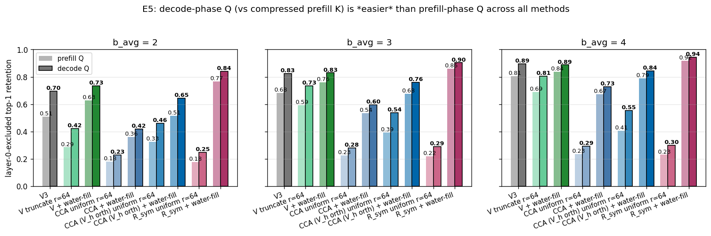
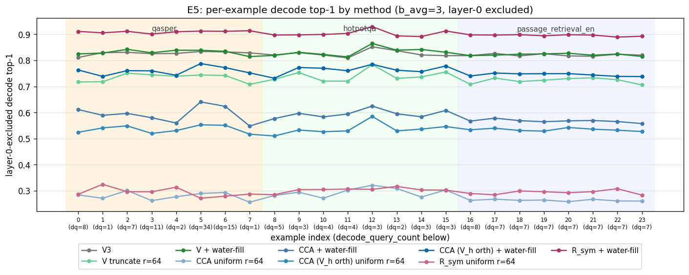

# KV-Cache Key Compression — Stage 1E Summary

## Introduction

When a transformer LLM generates text, every newly-produced token attends to all prior tokens via dot-product attention. To avoid recomputing the prompt forward pass for every new token, the model caches the keys ($K$) and values ($V$) of each attention head — the **KV cache**. This cache grows linearly with context length and quickly dominates GPU memory at long context, so **compressing the KV cache** is one of the highest-leverage levers for serving long-context LLMs cheaply.

This study (Stage 1E of an internal investigation) focuses on the **$K$** half of the cache, treated separately at each (layer, kv_head). The compression pipeline has three phases:

1. **Calibration (offline, once).** Observe queries and keys on a small representative prompt corpus and compute their second-moment statistics ($\Sigma_Q$, $\Sigma_K$, $C_{QK}$ — see the notation table below).
2. **Compression (online, per prefill).** Linearly transform each prefill key into a basis chosen using the calibration statistics, then independently scalar-quantize each coordinate to a small Lloyd–Max codebook scaled by that coordinate's standard deviation. The compressed cache replaces the raw cache.
3. **Reconstruction (online, per generated token).** When a future query $q$ arrives, dequantize the cached keys to get $\hat{k}$ and compute attention scores $q \cdot \hat{k}$ in place of $q \cdot k$.

Two design knobs govern this pipeline: **(a) the basis** to rotate into (random rotation, $\Sigma_Q$ eigenbasis, classical CCA, an orthogonal joint-$Q$-$K$ basis, …) and **(b) the per-coordinate bit allocation** (uniform, hard top-$r$ truncation, or continuous water-fill). We compare nine candidate (basis × allocation) pairs on Qwen3-8B over the LongBench-E 24-example bundle.

**Headline finding.** Classical Canonical Correlation Analysis (CCA) — the existing principled tool for joint-$Q$-$K$ analysis — solves a *different* optimization problem than KV-cache compression actually wants. CCA maximizes the *correlation* between $Q$ and $K$ projections (a scale-invariant objective that whitens away $K$-variance), whereas compression minimizes the $Q$-weighted reconstruction error of $K$ (scale-dependent in $K$-variance). The right basis is the one that orders coordinates by where $Q$-energy and $K$-variance jointly peak. We call it **JointQK** ($R_{\text{sym}}$, the orthogonal eigenbasis of $(\Sigma_Q \Sigma_K + \Sigma_K \Sigma_Q)/2$). Paired with reverse water-fill, **JointQK WaterFill** wins on every metric at every bit budget tested, beating the strongest prior baseline by ~10 percentage points in attention top-1 retention at 3 bits/coord and reaching within 6 pp of full-precision attention at 4 bits/coord.

**Roadmap.** §1 lists the nine candidate methods at a glance. §2 explains how they work — quantization pipeline, Lloyd-Max centroid construction, three bit-allocation families, the geometric meaning of each basis, the metrics we evaluate, and a derivation of why CCA's objective is the wrong one. §3 walks through the five experiments with selected charts. §4 gives the deployment recommendation. A final **TL;DR** recaps the headline numbers for fast reference.

---

## Notation & abbreviations

### Abbreviations

| Abbrev. | Meaning |
|---|---|
| **KV** | Key-Value (cache). The "K" we compress is the keys side of the per-layer self-attention KV cache. |
| **CCA** | Canonical Correlation Analysis. Classical multivariate statistics technique that finds direction pairs with maximum correlation between two variables, here $Q$ and $K$. |
| **SVD** | Singular Value Decomposition. |
| **LOO** | Leave-One-Out. A cross-validation scheme where for each held-out example you calibrate on the *other* $n-1$ examples in the same task and evaluate on the held-out one. |
| **GQA** | Grouped-Query Attention. Qwen3-8B groups every 4 query heads onto 1 key/value head; we GQA-pool the 4 query heads inside each group when forming $\Sigma_Q$ and $C_{QK}$. |
| **BOS** | Beginning-of-sequence token (and similar attention sinks). |
| **MSE** | Mean Squared Error. |
| **pp** | Percentage points. "+10 pp" means the absolute difference between two top-1 fractions is 0.10. |
| **fp16** | 16-bit floating point (the dtype used to store TurboQuant's per-token norm). |

### Math symbols

| Symbol | Meaning |
|---|---|
| $d$ | Head dimension (Qwen3-8B has $d = 128$). |
| $b_{\text{avg}}$ | Average bits per coordinate. The compression budget. |
| $b_j$ | Bits assigned to coordinate $j$ (varies under water-fill, fixed under uniform/truncate). |
| $r$ | Rank cutoff (top-$r$ coordinates kept under truncate methods; we use $r = 64$ throughout). |
| $\Sigma_Q,\ \Sigma_K$ | Per-(layer, kv_head) uncentered second moments of $Q$ and $K$, computed over prefill positions. |
| $C_{QK}$ | Per-(layer, kv_head) cross-moment $\mathbb{E}[q\,k^\top]$. |
| $\rho_j$ | $j$-th canonical correlation from the CCA SVD, in $[0, 1]$. |
| $V_h$ | Right-singular-vectors matrix from the whitened cross-moment SVD; orthogonal. |
| $P_K$ | CCA's full key projection: $V_h \cdot \Sigma_K^{-1/2}$ (non-orthogonal). |
| $R_{\text{sym}}$ | Eigvecs of $(\Sigma_Q \Sigma_K + \Sigma_K \Sigma_Q)/2$; orthogonal joint-$Q$-$K$ basis. |
| $r_{95}$ | Smallest rank that captures 95% of the canonical-correlation energy in a given (layer, kv_head). |

---

## 1. Methods compared

The compression problem fixes a per-coordinate average bit budget $b_{\text{avg}} \in \{2, 3, 4\}$ and a per-(layer, kv_head) head dimension $d = 128$. Each method is a (basis × allocation) pair.

| Method | Basis | Bit allocation |
|---|---|---|
| **TurboQuant** | Random Hadamard rotation + per-token unit-norm | Uniform Lloyd-Max bits/coord |
| **Q-Eigen Truncate (r=64)** | Eigvecs of $\Sigma_Q$ (orthogonal) | Top-64 coords, uniform bits |
| **Q-Eigen WaterFill** | Eigvecs of $\Sigma_Q$ (orthogonal) | Reverse water-fill on $\lambda_j(Q) \cdot \sigma_j^2(K)$ |
| **CCA-NonOrth Truncate (r=64)** | $P_K = V_h \Sigma_K^{-1/2}$ (non-orthogonal) | Top-64 coords, uniform bits |
| **CCA-NonOrth WaterFill** | $P_K$ (non-orthogonal) | Water-fill, trace-formula weight |
| **CCA-Orth Truncate (r=64)** | $V_h$ (orthogonal) | Top-64 coords, uniform bits |
| **CCA-Orth WaterFill** | $V_h$ (orthogonal) | Water-fill, basis-diag weights |
| **JointQK Truncate (r=64)** | Eigvecs of $(\Sigma_Q \Sigma_K + \Sigma_K \Sigma_Q)/2$ (orthogonal) | Top-64 coords, uniform bits |
| **JointQK WaterFill** ← winner | Eigvecs of $(\Sigma_Q \Sigma_K + \Sigma_K \Sigma_Q)/2$ (orthogonal) | Water-fill, basis-diag weights |

$\Sigma_Q$, $\Sigma_K$, $C_{QK}$ are the per-(layer, kv_head) uncentered second moments computed over prefill positions, GQA-pooled across the 4 query heads in each kv-head's group.

---

## 2. How the methods work

### 2.1 The compression pipeline

For every method, each prefill key $k \in \mathbb{R}^d$ is compressed in three steps:

1. **Linear basis transform** $c = k \cdot M_{\text{fwd}}$. The forward map rotates / projects the key into a basis where coordinates carry interpretable amounts of attention-relevant information. Different methods choose different $M_{\text{fwd}}$.
2. **Per-coordinate scalar quantization.** Each coordinate $c_j$ is independently rounded to the nearest centroid of a 1-D Lloyd-Max codebook scaled to that coordinate's standard deviation. Coordinates assigned $b_j = 0$ bits collapse to zero.
3. **Inverse transform** $\hat{k} = \tilde{c} \cdot M_{\text{inv}}$. For an orthogonal forward map, $M_{\text{inv}} = M_{\text{fwd}}^\top$. For the non-orthogonal CCA map ($P_K$), $M_{\text{inv}} = P_K^{-\top}$ is the matching back-projection.

TurboQuant is the only method that additionally divides each $k$ by its norm before step 2 and re-scales after step 3 (the norm is stored in fp16). All other methods quantize raw keys, with codebooks scaled to the per-coordinate std in the chosen basis.

### 2.2 Lloyd-Max centroids

The codebooks have a **two-level structure**: a globally shared *shape* and per-coordinate *scaling*.

- **Shared shape.** For each bit-count $b$, the unit-variance Lloyd–Max codebook (the $2^b$ centroid positions) is solved **once** via fixed-point iteration on the conditional-mean update and cached. This shape is reused for every (layer, kv_head, coord) that happens to be assigned $b$ bits.
- **Per-coord scaling.** At construction time each compressor multiplies the shared shape by the per-coordinate std

  $$\sigma_j = \sqrt{(B^\top \Sigma_K B)_{jj}}$$

  where $B$ is the (orthogonal) basis matrix for that head, computed from *that* head's calibrated covariance in *that* head's basis. So two coordinates that received the same $b_j$ share the codebook *shape* but sit at different absolute centroid positions because their $\sigma_j$ differs.

Net result: 36 layers × 8 kv_heads = **288 separate compressors**, each carrying up to 128 codebooks (one per coordinate). Bit allocation $b_j$ itself is per-(layer, head, coord) under water-fill; under uniform / truncate the bit pattern is shape-shared but the $\sigma$-scaling still differs head-by-head. A coordinate with $b_j = 0$ decodes to zero (its contribution is dropped from $\hat{k}$).

**TurboQuant is the exception.** It pre-unit-normalizes each token, so the source variance is the same $1/d$ for every coordinate. A single Lloyd–Max codebook — *not* per-coord $\sigma$-rescaled — is shared across every layer, head, and coordinate.

### 2.3 Bit allocation

Three families:

- **Uniform** (TurboQuant only): every coordinate gets the same $b_{\text{avg}}$ bits. No information about $Q$ or $K$ is consumed.
- **Truncate ($r = 64$)**: the top-64 coordinates (by basis-eigenvalue ordering) get $b_{\text{avg}} \cdot d / r$ bits each; the remaining 64 get 0. Hard low-rank cutoff.
- **Water-fill**: continuous reverse water-fill on the per-coordinate product $w_j \cdot \sigma_j^2(K)$, where $w_j$ is the $Q$-energy contribution of coordinate $j$ in the chosen basis. Bits flow to coordinates with the largest expected $Q$-weighted reconstruction MSE per bit, until the total budget is exhausted. The continuous solution is then rounded to integer bits with largest-remainder rounding so the total budget is preserved exactly.

### 2.4 Evaluation metrics

Two metrics show up throughout this report. Both are computed per (example, layer, kv_head) row, then aggregated; the headline numbers are layer-0-excluded means.

**Top-1 retention ($\mathrm{top}_1$).** Fraction of queries that pick the same key under the compressed cache as under the uncompressed cache. Concretely, for each query $q_t$ we form the prefill attention logits

$$
\ell_i \,=\, \frac{q_t \cdot k_i}{\sqrt{d}}, \qquad
\hat{\ell}_i \,=\, \frac{q_t \cdot \hat{k}_i}{\sqrt{d}}
$$

(the original and the post-roundtrip logit for query $q_t$ against key $k_i$) and check $\arg\max_i \ell_i = \arg\max_i \hat{\ell}_i$. The metric is the fraction of $q_t$ for which the two argmaxes agree, averaged over all queries in the row, all rows in the (example × layer × kv_head) cube, and the GQA group of 4 query heads per kv-head. Top-1 is the production metric: it answers "did this method preserve which key wins the attention competition?". $\mathrm{top}_5$ is the analogous "is the true argmax among the approximation's top-5?".

**$Q$-weighted geometry distortion ($D_{\mathrm{geo}}$).** Mean squared reconstruction error of the keys, weighted by the per-head $Q$ second moment $M_q = \mathbb{E}[q\, q^\top]$:

$$
D_{\mathrm{geo}} \,=\, \frac{1}{d}\, \mathbb{E}_t\!\left[ (k_t - \hat{k}_t)^\top \, M_q \, (k_t - \hat{k}_t) \right]
$$

This is the natural Frobenius-style distortion under the metric induced by $Q$: directions where queries actually have energy are penalised in proportion to that energy; directions queries don't read are essentially free to compress. $Q$-weighted geometry distortion is what the closed-form rate-distortion simulation is designed to predict; it equals the expected logit MSE up to a $1/d$ normalisation.

**Why both?** Geometry distortion is a smooth average — it tells you how much information about $q \cdot k$ you've lost on average. Top-1 is the production metric — it tells you how often the actually-selected key flips. The two rankings can disagree under non-orthogonal bases (e.g. CCA-NonOrth WaterFill is 2nd on geometry but 6th on top-1) because non-orthogonal inverses produce structured, basis-aligned reconstruction noise that flips specific argmaxes even when the average reconstruction error is small. Under orthogonal bases with continuous water-fill, the two rankings agree.

### 2.5 Basis families — geometric reading

- **Random rotation (TurboQuant).** Isotropic; ignores all calibration information. Useful as a structure-free baseline.
- **Q-Eigen.** Eigendecomposition of $\Sigma_Q = \mathbb{E}[q\, q^\top]$. Coordinates align with the directions of largest expected query energy. Uses $\Sigma_Q$ only — the basis does not see $K$'s covariance.
- **CCA-NonOrth.** The classical CCA construction. The key projection $P_K$ that maps a raw key $k$ into canonical-$K$ coordinates is built in two steps:

  1. *Whiten* both $Q$ and $K$ — pre-multiply by $\Sigma_Q^{-1/2}$ and $\Sigma_K^{-1/2}$ respectively — and SVD the whitened cross-moment:

     $$\Sigma_Q^{-1/2}\, C_{QK}\, \Sigma_K^{-1/2} \;=\; U \cdot \mathrm{diag}(\rho)\cdot V_h$$

     where $U$ and $V_h$ are orthogonal matrices and $\rho_j \in [0, 1]$ are the canonical correlations.

  2. *Compose* the whitening of $K$ with the orthogonal rotation $V_h$ to get the full key projection:

     $$P_K \;=\; V_h \cdot \Sigma_K^{-1/2}.$$

  In words: $P_K$ first whitens the key (via $\Sigma_K^{-1/2}$) and then orthogonally rotates the result onto the canonical-$K$ basis (via $V_h$). The $j$-th coordinate of $P_K\, k$ is the $j$-th canonical key score, ordered by $\rho_j$. The catch is that $P_K$ as a whole is **not orthogonal** because of the $\Sigma_K^{-1/2}$ factor: its inverse is $P_K^{-1} = \Sigma_K^{+1/2}\, V_h^\top$, *not* its transpose. The forward map "shrinks then rotates" while the inverse map "rotates back then re-stretches", and that re-stretching amplifies coordinate-aligned quantization noise unevenly across directions. The result is structured residual noise that flips specific top-1 argmaxes even when the average reconstruction error is small. This is the dominant CCA pathology.
- **CCA-Orth ($V_h$).** Use the orthogonal rotation $V_h$ directly as the basis — i.e. skip the $\Sigma_K^{-1/2}$ whitening step inside $P_K$ and project keys with $V_h$ alone. Same canonical-correlation ordering of coordinates as CCA-NonOrth (because $V_h$ is the same matrix in both), but now the basis is orthogonal: forward and inverse maps are transposes of each other, no noise amplification. Recovers most of the lost top-1 from CCA-NonOrth.
- **JointQK ($R_{\text{sym}}$).** Eigenvectors of the symmetric anti-commutator $(\Sigma_Q \Sigma_K + \Sigma_K \Sigma_Q)/2$. The high-eigenvalue directions are those along which a typical $q$ and a typical $k$ have aligned high variance simultaneously. Considers both $Q$'s and $K$'s covariance jointly while staying orthogonal. This is the basis that wins the study.

The methodological lesson — sharpened across the experiments below — is that **(orthogonal joint basis) × (continuous water-fill)** keeps the geometry-distortion ranking and the top-1-retention ranking aligned. Either ingredient relaxed in isolation costs you on the production metric.

### 2.6 Why CCA underperforms — objective mismatch

CCA solves a *different* optimization problem than KV-cache compression cares about. The mismatch is structural.

**What CCA optimizes.** Classical CCA finds direction pairs $(u_j, v_j)$ that maximize the *correlation*

$$
\rho_j = \frac{u_j^\top C_{QK}\, v_j}{\sqrt{(u_j^\top \Sigma_Q\, u_j)\,(v_j^\top \Sigma_K\, v_j)}}
$$

subject to a whitening normalization. Equivalently, it diagonalizes the whitened cross-moment $\Sigma_Q^{-1/2} C_{QK} \Sigma_K^{-1/2}$. The numerator measures how well $u_j^\top q$ linearly predicts $v_j^\top k$; the denominator divides out the variances on both sides. **CCA is scale-invariant on each side.**

**What KV-cache compression optimizes.** We want to minimize the expected attention-logit error after roundtrip. For a reconstruction $\hat{k}$ with error $\delta k = k - \hat{k}$,

$$
\mathbb{E}\!\left[(q \cdot k - q \cdot \hat{k})^2\right] = \mathbb{E}\!\left[\delta k^\top M_q\, \delta k\right], \qquad M_q = \Sigma_Q.
$$

The contribution of coordinate $j$ to this loss scales like $\lambda_j(M_q) \cdot \sigma_j^2(K)$ — high-$Q$-energy *and* high-$K$-variance coordinates dominate. **The compression objective is scale-*dependent*: it rewards spending bits where the product of $K$-variance and $Q$-energy is largest.**

**The mismatch.** Two coordinates with identical canonical correlation $\rho_j$ can contribute very different amounts to logit error if their $K$-variances differ. A coordinate with $\rho_j = 0.95$ but tiny $\sigma_j^2(K)$ contributes negligibly to attention; a coordinate with $\rho_j = 0.30$ but large $\sigma_j^2(K)$ may dominate. CCA's whitening factor $\Sigma_K^{-1/2}$ — the very thing that makes $\rho_j$ scale-invariant — is exactly what destroys the $K$-variance signal that the compression objective needs.

This pathology shows up two ways in the experiments:

1. **Wrong coordinate ordering.** Allocating bits by $\rho_j$ rank (CCA-NonOrth Truncate, CCA-NonOrth Uniform) over-spends on directions with low $K$-energy that contribute little to logit error. Both Truncate variants of CCA-NonOrth land near the bottom of the ranking.
2. **Non-orthogonal noise amplification.** $P_K = V_h \Sigma_K^{-1/2}$ carries the inverse whitening factor; the required back-projection $P_K^{-\top} = \Sigma_K^{1/2} V_h^\top$ amplifies coordinate-aligned quantization noise asymmetrically. The result is structured residual noise that flips specific top-1 argmaxes even when the *average* reconstruction error is small. CCA-NonOrth WaterFill is 2nd on geometry distortion (`0.097`) but only 6th on top-1 (`0.535`) for exactly this reason.

**Why JointQK gets the objective right.** The eigenbasis of $(\Sigma_Q \Sigma_K + \Sigma_K \Sigma_Q)/2$ orders coordinates by where $Q$-energy and $K$-variance peak *jointly* — directly mirroring the compression objective $\lambda_j(M_q) \cdot \sigma_j^2(K)$. The basis is orthogonal by construction (it's the eigvecs of a symmetric matrix), so the inverse is a transpose and the asymmetric noise amplification of CCA-NonOrth disappears. Combined with water-fill on $w_j \cdot \sigma_j^2(K)$, the bit allocation directly minimises the per-coordinate contribution to expected logit error. JointQK + WaterFill is, in this sense, the (basis × allocation) pair that most closely mirrors the actual loss function — which is why it simultaneously wins on both geometry distortion *and* top-1 retention.

CCA-Orth is the partial fix: dropping the $\Sigma_K^{-1/2}$ whitening factor restores orthogonality (and so eliminates the non-orthogonal noise amplification of point 2), but the basis still orders coordinates by canonical correlation rather than by joint $Q$-$K$ energy (point 1 remains). That is exactly why CCA-Orth WaterFill (top-1 = 0.675) closes most of the gap to Q-Eigen WaterFill (0.760) but doesn't reach JointQK WaterFill (0.860).

---

## 3. Experiments

Five experiments. We skip the closed-form rate-distortion simulation here for brevity.

### 3.1 E1 — Canonical correlation spectrum diagnostic

**Goal.** Before any compression, ask whether a low-rank attention-relevant subspace actually exists in Qwen3-8B's $(\Sigma_Q, \Sigma_K, C_{QK})$ second moments. The CCA-style and JointQK methods are only justified if a small $r \ll d$ captures most of the joint $Q$-$K$ coupling.

**Cumulative canonical-correlation energy vs rank.**

Each light-grey curve is one of the 280 (layer ≥ 1, kv_head) pairs; the blue curve is the median; the dashed black line marks the 95% energy threshold. **Take-away:** $r = 64$ captures **~94% of canonical-correlation energy** in the median head (87% – 96% over the 10–90 percentile range). The decay is moderate, not a sharp cliff — there isn't a small $r$ that captures *all* the coupling, but there is a real low-rank handle.

**Per-layer $r_{95}$ profile.**

For each layer, the median $r_{95}$ (the smallest rank capturing 95% of the canonical-correlation energy) across its 8 kv heads, with the 10–90% band. **Take-away:** layers 1–35 are tightly clustered around $r_{95} \approx 68$ with no clear depth-related trend. Layer 0 is the visible dip at the left ($r_{95} \approx 45$) — its spectrum is *steeper*, not flatter, an attention-sink signature where 1–2 BOS-style tokens dominate. The tightness of layers 1–35 justifies a single fixed $r$ outside layer 0; we use $r = 64$ throughout.

### 3.2 E1_2 — Q/K distribution diagnostics across phases and tasks

**Goal.** E4 and E5 (below) will show that the calibration-derived bases work well across tasks and across phases. E1_2 quantifies *why* — does it work because the underlying second-moment distributions are similar across tasks/phases (so calibration is essentially redundant), or because the methods are shift-robust (a stronger property)?

**Marginal cumulative energy per metric × task.**

Cumulative-energy curves of $\Sigma_Q^{\text{prefill}, \text{task}}$, $\Sigma_K^{\text{task}}$, $C_{QK}^{\text{prefill}, \text{task}}$ for each LongBench-E config. **Take-away:** the per-task cumulative-energy curves overlap nearly perfectly across the three configs. Cross-task functional gaps in E4 are small because the *underlying second moments themselves barely shift* across LongBench-E — calibration is generalising for distributional reasons, not just because the methods are robust.

**$r_{95}$ distribution per metric × task.**

Histograms of per-(layer, kv_head) $r_{95}$ for each (metric, task) pair. **Take-away:** the per-task $r_{95}$ distributions align within a few ranks for every metric ($\Sigma_Q$, $\Sigma_K$, $C_{QK}$). Decode-$Q$ is somewhat noisier, since per-task decode-token counts (27–79) are statistically thin compared to prefill (25k+). The aggregated cross-task behaviour is reliable; per-example decode-only headlines warrant caution.

**Top-$r$ subspace overlap between tasks.**

*How the metric is computed.* For each task $\tau$ and each (layer, kv_head), we eigendecompose its calibrated covariance $\Sigma^{(\tau)}$ (one of $\Sigma_Q$, $\Sigma_K$, $C_{QK}$) and sort the eigenvectors by eigenvalue descending. The first $r$ eigenvectors form a $d \times r$ matrix $P^{(\tau)}_r$ — these span the **top-$r$ subspace**, the $r$-dimensional ellipsoid where most of $\Sigma^{(\tau)}$'s energy lives. For two tasks $\tau_a$ and $\tau_b$, the overlap is

$$
\text{overlap}(r) \;=\; \frac{1}{r}\, \big\| (P^{(\tau_a)}_r)^\top \, P^{(\tau_b)}_r \big\|_F^2 \;\in\; [0, 1].
$$

Equivalently this equals $\frac{1}{r}\sum_{i=1}^{r} \cos^2 \theta_i$, where $\theta_i$ are the principal angles between the two subspaces, or $\frac{1}{r}\,\mathrm{tr}(\Pi_a \Pi_b)$ where $\Pi_\tau = P^{(\tau)}_r (P^{(\tau)}_r)^\top$ is the orthogonal projector onto $\tau$'s top-$r$ subspace. Overlap = 1 means the two top-$r$ subspaces span exactly the same $r$-dimensional space (just possibly with different individual eigenvector orientations within that span); overlap = 0 means the two subspaces are mutually orthogonal. The chart shows this overlap averaged across all 288 (layer, kv_head) pairs at each rank $r$.

*Why this is the right metric for our purposes.* Compression methods that use only the top-$r$ directions (truncate variants and water-fill at low budgets) only depend on the **span** of the top-$r$ eigenvectors, not on how they're individually rotated within that span. Two tasks with completely different per-eigenvector orderings can produce identical compression behaviour as long as the spans match. The Frobenius-projector formula measures span-equivalence directly and ignores within-subspace rotations.

**Take-away:** top-$r$ eigenvector subspaces between any two LongBench-E configs have ≥ 0.95 overlap across the rank range our methods care about ($r \in [16, 96]$) for every metric ($\Sigma_Q$, $\Sigma_K$, $C_{QK}$). Calibration done on one config genuinely transfers to the others — the second-moment geometry is essentially task-independent at this scale.

### 3.3 E3 — Real per-coordinate quantization

**Goal.** Quantize the prefill keys with each (basis × allocation) method at $b_{\text{avg}} \in \{2, 3, 4\}$ and $r = 64$, reconstruct, and measure attention top-1 retention against the original prefill queries. This is the headline real-quantization comparison.

**Headline at $b_{\text{avg}} = 3$, layer-0-excluded** (24 examples × 36 layers × 8 kv_heads = 6,912 rows / method):

| Method | top-1 ↑ | logit_mse ↓ | geo_dist ↓ | top-5 ↑ |
|---|---:|---:|---:|---:|
| **JointQK WaterFill** | **0.860** | **0.054** | **0.054** | **0.993** |
| Q-Eigen WaterFill | 0.760 | 0.066 | 0.066 | 0.937 |
| CCA-Orth WaterFill | 0.675 | 0.198 | 0.197 | 0.898 |
| TurboQuant | 0.682 | 0.457 | 0.456 | 0.906 |
| Q-Eigen Truncate (r=64) | 0.592 | 0.537 | 0.528 | 0.856 |
| CCA-NonOrth WaterFill | 0.535 | 0.097 | 0.097 | 0.762 |
| CCA-Orth Truncate (r=64) | 0.393 | 6.351 | 6.200 | 0.567 |
| CCA-NonOrth Truncate (r=64) | 0.226 | 0.863 | 0.859 | 0.414 |
| JointQK Truncate (r=64) | 0.219 | 61.97 | 62.08 | 0.383 |

Two structural facts are worth flagging:

- **JointQK WaterFill wins on every metric** (top-1, top-5, geometry, logit MSE). Q-Eigen WaterFill, the prior champion, slips to second by ~10 pp top-1.
- **CCA-Orth WaterFill recovers +14.0 pp top-1 over CCA-NonOrth WaterFill** at the same canonical-correlation ordering — confirming the $V_h$-orthogonality lesson: CCA-NonOrth WaterFill was bottlenecked by the non-orthogonal noise amplification of $P_K$, not by the canonical-correlation basis itself.
- All four Truncate variants underperform their WaterFill counterparts dramatically; hard low-rank cutoffs amplify per-coordinate variance heterogeneity in the orthogonal bases (witness JointQK Truncate's 62× geometry-distortion ratio over its WaterFill counterpart).

**Bit-budget sensitivity.**

Top-1 retention (left) and geometry distortion (right, log scale) versus $b_{\text{avg}} \in \{2, 3, 4\}$ per method. **Take-away:** JointQK WaterFill wins at every bit budget by a wider margin at low $b_{\text{avg}}$ (+13.9 pp top-1 over Q-Eigen WaterFill at $b=2$, +10.0 pp at $b=3$, +8.2 pp at $b=4$) — the joint-$Q$-$K$ basis pays off most exactly when bits are scarce and the basis has to land on the right coordinates. This is a sustained advantage, not the shrinking-with-budget pattern Q-Eigen WaterFill showed against TurboQuant.

### 3.4 E4 — Generalization (cross-task + within-task LOO)

**Goal.** Test whether the calibration-derived bases survive being computed on one LongBench-E config and used on the others (E4a), and whether dropping a single calibration example moves the metrics (E4b). The "calibrate offline once, deploy everywhere" pitch lives or dies here.

**Cross-task geometry-distortion heatmap.**

Per method, a $3\times3$ (calibration-source × evaluation-config) heatmap of layer-0-excluded geometry distortion at $b_{\text{avg}} = 3$. **Take-away:** cells are flat across calibration sources for the three water-fill methods (Q-Eigen WaterFill, CCA-Orth WaterFill, JointQK WaterFill). Geometry barely shifts when calibration is moved between qasper, hotpotqa, and passage_retrieval_en. The Truncate variants are the most cross-task-sensitive on geometry — another reason hard cutoffs are fragile. JointQK WaterFill's per-cell range is the tightest in the entire panel.

**Within-task LOO per-fold top-1.**

Per-method top-1 across 24 leave-one-out folds (8 per config × 3 configs), with shaded config bands. **Take-away:** the method ranking is preserved on every single fold. JointQK WaterFill is the top trace at all 24 folds; LOO standard deviation within a config is ≤ 0.009 for the new methods (comparable to or below Q-Eigen WaterFill's 0.003–0.013). No fold flips the winner. Cross-task aggregate top-1 for JointQK WaterFill is $0.856 / 0.857 / 0.858$ across the three calibration sources — a 0.2 pp spread, tighter than the calibration-independent TurboQuant baseline.

### 3.5 E5 — Decode-phase Q against compressed prefill cache

**Goal.** The production scenario is "compress the prefill $K$ cache, then generate against it." E5 evaluates each method's compressed prefill cache against decode-phase queries (the actually-generated tokens) to verify the prefill-only metrics from E3 transfer to the deployment regime.

**Decode top-1 vs prefill top-1 across methods × bit budgets.**

Per (method, $b_{\text{avg}}$) pair, two bars: prefill-$Q$ top-1 (light) and decode-$Q$ top-1 (dark, weighted by the number of decode queries per example). **Take-away:** decode top-1 is **higher than prefill top-1 for every method at every bit budget**. Generated tokens have peakier attention distributions than prefill, which makes them more forgiving of reconstruction noise. JointQK WaterFill reaches **0.904 decode top-1 at $b=3$ and 0.944 at $b=4$** — within 6 pp of full-precision attention. The decode-vs-prefill gap is *smaller* for JointQK WaterFill than for the other methods, because it's already so close to the ceiling that there's less headroom for decode-easier-than-prefill to recover.

**Per-example decode top-1.**

For each of the 24 examples, per-method decode top-1 with shaded config bands. **Take-away:** per-example decode top-1 is essentially flat across the 24 examples for the water-fill methods — the decode advantage is broad-based, not driven by a few outlier examples. Caveat: per-example decode-query counts range 1–34 (mean 6.8), so per-example numbers carry more noise than the aggregated headline. The aggregated cross-example numbers above are still credible because each row already averages over the GQA group's 4 query heads, and the aggregation is over $24 \times 36 \times 8 = 6{,}912$ rows.

---

## 4. Recommendation

Stage 3 should adopt **JointQK WaterFill** as the canonical KV-cache key compression. It wins on every metric at every bit budget, generalizes across tasks (cross-task spread ≤ 0.3 pp top-1) and across samples (within-task LOO std dev ≤ 0.009 top-1), and is robust under the production prefill-then-decode evaluation. The basis (orthogonal eigvecs of $(\Sigma_Q \Sigma_K + \Sigma_K \Sigma_Q)/2$) costs one eigendecomposition per (layer, kv_head) at calibration time and applies as a transpose at inference — strictly cheaper than the SVD-of-whitened-cross-moment that the original CCA design needed.

**Q-Eigen WaterFill** is the safe fallback if $\Sigma_K$ is unavailable in the deployment context — though this seems unlikely given it's a model-side statistic. **CCA-Orth WaterFill** is the recommended intermediate if you want to retain the canonical-correlation interpretation. **CCA-NonOrth WaterFill** is obsolete: CCA-Orth WaterFill strictly dominates it on every metric. The four Truncate (r=64) variants underperform their WaterFill counterparts by 30-65 pp top-1 at $b_{\text{avg}} = 3$ and should not be used.

---

## TL;DR

We compared nine KV-cache key compression methods on Qwen3-8B over the LongBench-E 24-example bundle. **The winner is JointQK WaterFill — a per-coordinate scalar quantizer in the orthogonal eigenbasis of the symmetric anti-commutator $(\Sigma_Q \Sigma_K + \Sigma_K \Sigma_Q)/2$, with reverse water-fill bit allocation.** At 3 bits / coord (layer-0 excluded, prefill-attention top-1 retention) it reaches **0.860**, beating the strongest prior baseline by ~10 pp; at 4 bits the decode-phase top-1 reaches **0.944** — within 6 pp of full-precision attention. The win is sustained across bit budgets (2, 3, 4), three calibration sources (qasper, hotpotqa, passage_retrieval_en), 24 leave-one-out folds, and prefill-vs-decode evaluation.

**Why CCA underperforms.** Classical CCA maximizes the *correlation* between $Q$ and $K$ projections — a scale-invariant objective that whitens away $K$-variance. KV-cache compression actually minimizes the $Q$-weighted reconstruction error of $K$, which is *scale-dependent*: the per-coordinate contribution to logit error scales as ($Q$-energy $\times$ $K$-variance), not as canonical correlation. JointQK's basis orders coordinates by exactly this joint-energy product, directly matching the compression objective; CCA does not (see §2.6 for the derivation).

**Recommendation.** Adopt **JointQK WaterFill** as the canonical Stage 3 design. **Q-Eigen WaterFill** is the safe fallback. The original CCA design (non-orthogonal $P_K$) is obsolete and superseded by its orthogonal cousin. All four Truncate (r=64) variants underperform their WaterFill counterparts and should not be used.
